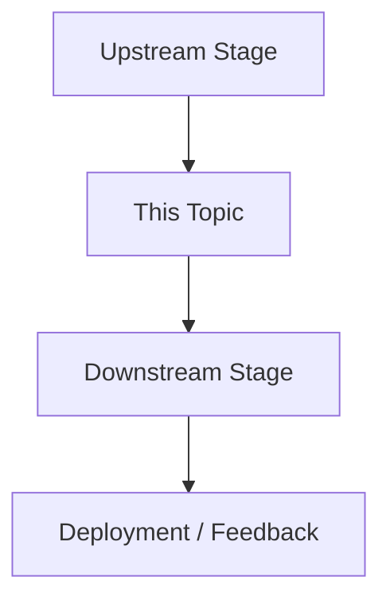

# 00 Index

这是 `references/` 知识库的总索引页，用于导航整个 LM Wiki。

LM Wiki 有三个目标：

1. 帮助我沉淀自己的 AI 技术认知；
2. 帮助其他非技术背景的人理解 LLM；
3. 做成 Skill，让学习变成可沉淀、可复用、可长期迭代的事情。

本知识库围绕 LLM Industrial Pipeline 组织：

> Compute -> Data -> Architecture -> Training Infrastructure -> Pretraining -> Mid-training -> Post-training -> Evaluation -> Inference -> Agent -> Online Feedback

---

## 01 Core Pipeline：大模型工业链路

这一部分解释一个现代 LLM 如何被构建、训练、评测、部署，并通过线上反馈持续迭代。

- `references/01_core_pipeline/01a_compute.md`
  解释算力资源、GPU 集群、网络、存储、调度系统，以及为什么 Compute 是 LLM 训练的物理底座。

- `references/01_core_pipeline/01b_data.md`
  解释数据来源、清洗、过滤、去重、数据配比，以及 pretraining、mid-training、post-training、eval、online feedback 中不同数据集的作用。

- `references/01_core_pipeline/01c_architecture.md`
  解释 Transformer、Attention、MoE、长上下文、多模态架构，以及模型设计中的核心 trade-off。

- `references/01_core_pipeline/01d_training_infra.md`
  解释分布式训练基础设施、并行策略、通信、checkpoint、容错和训练稳定性。

- `references/01_core_pipeline/01e_pretraining.md`
  解释 base model 如何通过 next-token prediction 学习语言、知识、代码、数学和基础推理能力。

- `references/01_core_pipeline/01f_mid_training.md`
  解释模型在 pretraining 之后如何通过定向继续训练，强化代码、数学、长上下文、领域知识、工具使用或多模态能力。

- `references/01_core_pipeline/01g_post_training.md`
  解释 base model 如何通过 SFT、RL、verifier、agentic environment training 和 evaluation loop 变成可用模型。

- `references/01_core_pipeline/01h_evaluation.md`
  解释 base eval、instruct eval、reasoning eval、coding eval、agent eval、long-context eval、人类偏好评测和业务评测。

- `references/01_core_pipeline/01i_deployment_and_inference.md`
  解释 Deployment & Inference、serving runtime、KV cache、batching、vLLM、SGLang、latency、throughput 和部署成本。

- `references/01_core_pipeline/01j_agent_harness.md`
  解释 tool calling、browser use、terminal use、planning、memory、workflow orchestration 和 agent task completion。

- `references/01_core_pipeline/01k_online_feedback.md`
  解释 Online Feedback、Online RL、rollout-driven post-training、训推一体、失败案例挖掘、A/B testing 和 continuous improvement 闭环。

---

## 02 Core Concept：核心概念

这一部分解释 LLM 工业系统中的可复用技术概念。当前先作为基础概念收纳入口，后续再逐步拆分。

- `references/02_core_concept/02a_category.md`
  收纳训练信号、learning rate 等基础概念条目。

---

## 03 Models：模型家族

这一部分跟踪主流模型家族和 AI Lab 的技术路线。

- `references/03_models/gpt.md`
  跟踪 OpenAI GPT 系列在 chat、reasoning、coding、agent 和 multimodal 能力上的演进。

- `references/03_models/claude.md`
  跟踪 Anthropic Claude 系列、Constitutional AI、RLHF/RLAIF、extended thinking、tool use 和 agentic workflows。

- `references/03_models/gemini.md`
  跟踪 Google DeepMind Gemini 系列、native multimodal、long context、reasoning 和 agent 能力。

- `references/03_models/deepseek.md`
  跟踪 DeepSeek 系列的 MoE 架构、long-context 设计、RL、reasoning 和开源模型策略。

- `references/03_models/qwen.md`
  跟踪 Alibaba Qwen 系列的开源生态、reasoning、coding、multimodal 和 agent 能力。

- `references/03_models/llama.md`
  跟踪 Meta Llama 系列的 open-weight 策略、多模态扩展和生态定位。

- `references/03_models/hunyuan.md`
  跟踪 Tencent Hunyuan 系列的架构、预训练、后训练、评测、部署和产品集成。

---

## 04 Benchmarks：评测基准

这一部分解释模型能力通常如何被评估。

- `references/04_benchmarks/mmlu.md`
  解释 MMLU，以及它如何评估模型的广泛学科知识和世界知识。

- `references/04_benchmarks/gpqa.md`
  解释 GPQA，以及它如何评估研究生级别的科学推理能力。

- `references/04_benchmarks/swe_bench.md`
  解释 SWE-bench，以及它如何评估真实软件工程任务完成能力。

- `references/04_benchmarks/terminal_bench.md`
  解释 Terminal-Bench，以及它如何评估命令行和终端环境下的 agent 任务能力。

- `references/04_benchmarks/browsecomp.md`
  解释 BrowseComp，以及它如何评估网页浏览和搜索 agent 能力。

---

## 05 Recruiting：招聘与人才判断

这一部分将技术理解转化为 AI Talent Mapping、候选人 pre-talk 和技术招聘判断。

- `references/05_recruiting/role_mapping.md`
  将 LLM pipeline 中的不同阶段映射到 AI Lab 常见岗位、团队和 ownership。

- `references/05_recruiting/candidate_signals.md`
  定义评估 AI 候选人时的 strong signals、weak signals 和 risk signals。

- `references/05_recruiting/pre_talk_questions.md`
  提供不同 LLM 技术方向下的结构化 pre-talk 问题。

- `references/05_recruiting/lab_org_mapping.md`
  解释 AI Lab 常见组织结构，包括 foundation model、post-training、infra、eval、agent、product 和 safety 团队。

---

## 推荐阅读顺序

### 如果你是非技术背景读者

建议先读：

1. `references/01_core_pipeline/01b_data.md`
2. `references/01_core_pipeline/01c_architecture.md`
3. `references/01_core_pipeline/01e_pretraining.md`
4. `references/01_core_pipeline/01g_post_training.md`
5. `references/01_core_pipeline/01h_evaluation.md`
6. `references/01_core_pipeline/01i_deployment_and_inference.md`
7. `references/01_core_pipeline/01j_agent_harness.md`

目标是先建立直觉：模型从哪里学来能力，如何变得可用，如何被评测和部署。

---

### 如果你想建立完整 LLM 工业系统视角

建议按 pipeline 顺序阅读：

1. `references/01_core_pipeline/01a_compute.md`
2. `references/01_core_pipeline/01b_data.md`
3. `references/01_core_pipeline/01c_architecture.md`
4. `references/01_core_pipeline/01d_training_infra.md`
5. `references/01_core_pipeline/01e_pretraining.md`
6. `references/01_core_pipeline/01f_mid_training.md`
7. `references/01_core_pipeline/01g_post_training.md`
8. `references/01_core_pipeline/01h_evaluation.md`
9. `references/01_core_pipeline/01i_deployment_and_inference.md`
10. `references/01_core_pipeline/01j_agent_harness.md`
11. `references/01_core_pipeline/01k_online_feedback.md`

目标是理解一个现代 LLM 从算力、数据、训练到产品化和持续迭代的完整链路。

---

### 如果你用于招聘和 Talent Mapping

建议先读：

1. `references/05_recruiting/role_mapping.md`
2. `references/05_recruiting/candidate_signals.md`
3. `references/05_recruiting/pre_talk_questions.md`
4. `references/05_recruiting/lab_org_mapping.md`
5. 再按候选人方向查阅 `references/01_core_pipeline/`、`references/02_core_concept/`、`references/03_models/` 和 `references/04_benchmarks/` 中的相关技术页。

目标是把技术概念转化为候选人判断、团队归属判断和 pre-talk 问题。

---

## 每篇 reference 的默认结构

每个 reference 文件建议采用接近 `01g_post_training.md` 的写法：先建立直觉，再给定义，再放回 LLM 工业链路，最后展开机制、系统闭环和招聘判断。

````markdown
# Topic
English Subtitle / One-line Technical Positioning
> 中文直觉解释：用一句话说明这个 topic 到底解决什么问题

## Table of Contents

- [TL;DR](#tldr)
- [Definition](#definition)
- [Pipeline Position](#pipeline-position)
- [Core Question](#core-question)
- [Core Mechanism](#core-mechanism)
- [System View](#system-view)
- [Recruiting Translation](#recruiting-translation)
- [Sources](#sources)

## TL;DR

用 2-4 段说明这个 topic 的核心价值：
它是什么、为什么重要、它在 LLM 工业链路里改变了什么。

## Definition

给出精确定义。
可以使用 Python-like pseudo code、公式、流程图或 bullet list，把概念表达得更结构化。

## Pipeline Position

说明它位于 LLM pipeline 的哪一段：



重点回答：
- 上游依赖什么？
- 下游影响什么？
- 它和其他 pipeline stage 的边界在哪里？

## Core Question

这一节回答这个 topic 最本质的问题。

例如：
- 对模型家族：这个模型家族的技术路线到底是什么？
- 对 benchmark：它到底在测什么能力？
- 对 recruiting：它到底帮助判断候选人的哪类真实能力？
- 对 pipeline stage：这一阶段到底把模型从什么状态变成什么状态？

## Core Mechanism

拆解核心机制、方法或组成部分。

可以按 topic 类型调整：
- Pipeline topic：core recipe / data / infra / eval / feedback
- Model topic：architecture / training / post-training / product integration / ecosystem
- Benchmark topic：task design / scoring / protocol / limitations
- Recruiting topic：signals / questions / ownership / role mapping

## System View

从系统角度解释它如何与数据、训练、评测、推理、Agent、线上反馈形成闭环。

这一节优先写：
- 输入是什么？
- 输出是什么？
- 谁消费这个输出？
- 如何被验证？
- 如何进入下一轮迭代？

## Sources

列出 papers、technical reports、official blogs、benchmarks、GitHub repos、model cards 或 company announcements。
未验证的信息必须标记为 inference / hypothesis。
````

---

## Update Log Template

项目级更新统一写进 `README.md` 的 `Current Status`，并使用真实 git commit 时间。每次重要更新建议追加一个紧凑条目：

```markdown
#### YYYY-MM-DD HH:MM +TZ - Short Update Title

- Commit: `short_sha`
- Scope: pipeline / model / benchmark / recruiting / skill
- Files: `path/to/file.md`, `path/to/other.md`
- Change: 一句话说明改了什么。
- Why it matters: 一句话说明它对理解 LLM 工业链路或招聘判断有什么价值。
- Next: 可选，写下一步。
```

单篇 reference 的 `## Update Log` 只在内容会持续追踪变化时使用，例如模型家族、快速变化的 benchmark、Online RL 这类 living topic。一般放在 `Sources` 后面，避免打断正文阅读。
