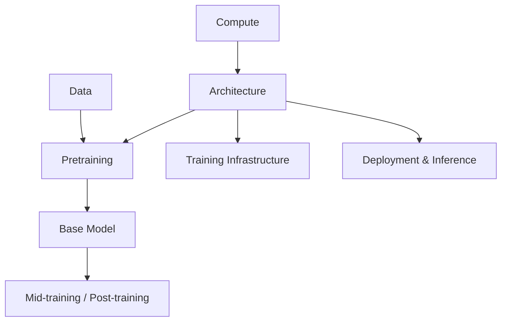

# Architecture
Model Blueprint / How Tokens Flow Through the Network
> 中文直觉解释：Architecture 是模型的“结构蓝图”，决定 token 进入模型后如何被表示、如何互相看见、如何被加工，最后如何变成 logits。

## Table of Contents

- [TL;DR](#tldr)
- [Definition](#definition)
- [Pipeline Position](#pipeline-position)
- [Boundary with Pretraining](#boundary-with-pretraining)
- [Core Question](#core-question)
- [Forward Path](#forward-path)
- [Core Building Blocks](#core-building-blocks)
- [Architecture Design Axes](#architecture-design-axes)
- [DeepSeek-V4 Architecture Case Study](#deepseek-v4-architecture-case-study)
- [System View](#system-view)
- [Common Misunderstandings](#common-misunderstandings)
- [Recruiting Translation](#recruiting-translation)
- [Future Learning Slots](#future-learning-slots)
- [Simple Analogy](#simple-analogy)
- [Sources](#sources)
- [Open Questions](#open-questions)

## TL;DR

Architecture 决定模型“如何处理 token”。对现代生成式 LLM 来说，主流结构仍然是 decoder-only Transformer：token IDs 先变成 hidden vectors，再经过多层 Transformer blocks，用 attention 融合上下文，用 MLP / MoE 加工特征，最后通过 LM head 输出 vocabulary logits。

最短主线是：

```text
Token IDs
↓
Embeddings
↓
Transformer Blocks
↓
Final Hidden States
↓
LM Head
↓
Logits
```

这篇只讲模型结构蓝图：backbone、attention、position encoding、MLP / MoE、normalization、residual path、context length、multimodal entry points、inference cost implications。它不讲 pretraining recipe：训练目标、optimizer、learning rate schedule、data curriculum、checkpoint eval 归到 `01e_pretraining.md`。

一句话：**Architecture 是模型能被怎样训练和怎样服务的结构约束；Pretraining 是在这个结构上用数据和优化算法把参数学出来。**

## Definition

Architecture 是模型的静态结构设计。

```python
Architecture = define_model_graph(
    inputs = {
        token_ids,
        position_information,
        optional_modal_inputs,
    },
    modules = {
        tokenizer_interface,
        embedding_table,
        transformer_blocks,
        attention_layers,
        mlp_or_moe_layers,
        normalization,
        residual_connections,
        lm_head,
    },
    constraints = {
        parameter_count,
        active_parameter_count,
        context_length,
        memory_footprint,
        inference_cost,
        trainability,
    },
)
```

Architecture 不等于训练过程。它定义“模型长什么样”；pretraining 定义“如何把参数学出来”。

## Pipeline Position



Architecture 位于 Data 和 Training 之前，是 LLM 工业链路里的结构决策层。

它向上依赖：

- Compute：GPU / accelerator memory、network bandwidth、kernel ecosystem 会限制可行 architecture。
- Target Capability：是否强调 long context、MoE、multimodal、code、agent、low-latency serving。

它向下影响：

- Training Infrastructure：parallelism、activation memory、communication pattern。
- Pretraining：模型是否容易稳定训练，context length 如何扩展。
- Inference：KV cache、batching、active parameters、latency、throughput。
- Agent / Online Feedback：tool schema、long trajectory、RL rollout 是否可承受。

## Boundary with Pretraining

这篇和 `01e_pretraining.md` 的边界很重要。

| Question | Belongs To | Why |
| --- | --- | --- |
| 模型有多少层、hidden size 多大？ | Architecture | 这是结构蓝图 |
| 使用 MHA、GQA、MLA、Sparse Attention 还是 Hybrid Attention？ | Architecture | 这是 token 如何互相看见 |
| 使用 dense MLP 还是 MoE？ | Architecture | 这是每层如何加工特征 |
| 使用 RMSNorm、residual、mHC 等连接方式？ | Architecture | 这是信号如何在网络中传播 |
| 用 next-token prediction 还是 MTP loss？ | Pretraining | 这是训练目标 |
| 用 AdamW 还是 Muon？ | Pretraining | 这是 optimizer recipe |
| learning rate warmup / decay 怎么设？ | Pretraining | 这是 training schedule |
| 什么时候引入 code / math / long-context data？ | Pretraining / Mid-training | 这是 data curriculum |
| checkpoint 怎么 eval？ | Pretraining / Evaluation | 这是训练控制和评估策略 |

架构会影响 pretraining，但不等于 pretraining。比如 MoE 架构会让训练需要 expert parallelism，也会让 serving 需要 expert routing；但“怎么训练 MoE 稳定”属于 pretraining / training infra 的问题。

## Core Question

Architecture 的核心问题是：

> **如何设计一个计算图，让 token 能高效建模上下文、表达知识和能力，同时还能被训练、部署和扩展？**

这不是“堆更多层”这么简单。架构决策会同时影响：

- model capacity；
- context modeling；
- training stability；
- memory usage；
- inference cost；
- parallelism strategy；
- long-context ability；
- agent workload cost。

## Forward Path

Architecture 最核心的直觉是 forward path：一个 token sequence 如何流过模型。

```text
Raw text
↓
Tokenizer
↓
Token IDs
↓
Embedding
↓
Position Information
↓
Transformer Block × N
↓
Final Norm
↓
LM Head
↓
Logits over Vocabulary
```

注意：loss、backward、optimizer update 不属于 architecture forward path。它们属于 pretraining。

### Transformer Block Loop

一个典型 decoder-only Transformer block 可以理解为：

```text
hidden states
↓
Norm
↓
Masked Self-Attention
↓
Residual Add
↓
Norm
↓
MLP / MoE
↓
Residual Add
↓
updated hidden states
```

这个循环不是“生成 token 的循环”，而是 hidden states 在多层网络中逐步被加工的循环。

生成 token 的循环发生在 inference decode 阶段；每一步 decode 都会跑一次 forward，并生成一个新 token。

## Core Building Blocks

### Tokenizer Interface

Tokenizer 把文本切成 token IDs。严格说 tokenizer 不是神经网络层，但它决定模型看到的基本符号单位。

Architecture 关心 tokenizer interface，因为 vocabulary size、special tokens、tool-call tokens、multimodal tokens 都会影响 embedding table 和 LM head。

### Embedding

Embedding 把 token IDs 映射成 hidden vectors。模型之后处理的不是文字本身，而是向量。

```text
token_id -> embedding_vector
```

### Position Encoding

Transformer 本身没有天然顺序感，需要 position information。常见方案包括 absolute positional embedding、RoPE、ALiBi、long-context 扩展方法等。

Position encoding 决定模型如何理解 token 的相对位置，尤其影响 long context。

### Attention

Attention 决定 token 如何看上下文。decoder-only LLM 使用 causal / masked self-attention，保证当前位置不能偷看未来 token。

常见 attention variants：

- MHA：Multi-Head Attention，经典方案；
- MQA：Multi-Query Attention，减少 KV cache；
- GQA：Grouped-Query Attention，在质量和 KV cache 成本之间折中；
- MLA：Multi-head Latent Attention，压缩 KV 表示；
- Sliding / Sparse / Hybrid Attention：服务 long-context efficiency。

Attention 是 architecture 和 inference cost 连接最紧的模块，因为 KV cache、context length、decode latency 都被 attention 设计强烈影响。

### MLP / FFN

MLP / FFN 是每个 Transformer block 里加工 hidden states 的模块。Attention 负责“看哪里”，MLP 负责“加工看到的信息”。

常见设计包括 dense FFN、SwiGLU / GeGLU 等 gated FFN。

### MoE

Mixture-of-Experts 把 dense MLP 替换成多个 experts，每个 token 只激活少数 experts。

直觉：

```text
total parameters 很大
active parameters 较小
```

MoE 的价值是增加模型容量，同时控制每个 token 的计算量。代价是 routing、expert load balancing、training stability、serving communication 都更复杂。

### Normalization

LayerNorm / RMSNorm 用来稳定 hidden states 的尺度，让深层网络更容易训练。

在现代 LLM 中，RMSNorm 很常见，因为它更简单，计算也更轻。

### Residual Path

Residual connection 让模型每层在原 hidden states 上增量修改，而不是完全重写。这有助于深层信号传播。

直觉：

```text
new_hidden = old_hidden + layer_update
```

Deep models 没有 residual path 会很难稳定训练。

### LM Head

LM head 把最终 hidden states 投影到 vocabulary 维度，得到每个 token 的 logits。

```text
hidden_state -> logits_over_vocab
```

Softmax、loss 计算和 optimizer update 属于训练过程，不是 architecture 本身。

## Architecture Design Axes

Architecture 可以按几个设计轴理解。

### Backbone

主流生成式 LLM 是 decoder-only Transformer。

GPT 系列证明了这个结构在 next-token prediction 上可扩展，后续大多数 LLM 都沿着这条路线演化。Encoder-decoder、encoder-only、state-space、hybrid architectures 也存在，但当前工业主线仍然是 decoder-only Transformer。

### Capacity

Capacity 由参数量、层数、hidden size、FFN size、expert 数量等决定。

Dense model 的每个 token 通常激活大部分参数；MoE model 的总参数很大，但每个 token 只激活一部分参数。

### Context

Context length 由 attention、position encoding、KV cache strategy、training / inference memory 共同约束。

Architecture 层面要问：

- 模型理论上支持多长 context？
- attention 的 FLOPs 如何随 context 增长？
- KV cache 如何随 context 增长？
- long-context 是靠 dense attention、sparse attention、compression 还是 hybrid design？

### Efficiency

Efficiency 不只是训练速度，也包括 inference cost。

Architecture 会决定：

- 每 token FLOPs；
- KV cache size；
- active parameters；
- parallelism strategy；
- serving latency；
- memory bandwidth pressure。

### Modality Interface

Multimodal architecture 需要把 image、audio、video、action 或 tool outputs 变成模型能处理的 token / embeddings。

这里先只保留入口：多模态不是单独 pipeline stage，而是 architecture、data、pretraining、post-training、evaluation、inference 的组合问题。

### Agent Compatibility

Agent workload 会给 architecture 带来新压力：

- long context；
- tool schema tokens；
- structured output；
- recurrent interaction；
- long trajectory memory；
- RL rollout cost。

架构不直接“实现 agent”，但会决定 agent workload 是否可承受。

## DeepSeek-V4 Architecture Case Study

DeepSeek-V4 是一个适合观察现代 architecture trade-off 的案例。这里仅讨论 architecture，不展开 optimizer、schedule、data curriculum，这些放在 `01e_pretraining.md`。

### MoE Capacity

DeepSeek-V4-Pro 和 V4-Flash 都是 MoE models：

| Model | Total Params | Active Params | Architecture Meaning |
| --- | ---: | ---: | --- |
| DeepSeek-V4-Pro | 1.6T | 49B | 大总容量，每 token 只激活部分专家 |
| DeepSeek-V4-Flash | 284B | 13B | 更轻的 MoE 配置，服务成本更低 |

这个例子说明：看 MoE 架构时，不能只看 total parameters，也要看 active parameters。

### Hybrid Attention for Long Context

DeepSeek-V4 从 V3 系列的 MLA 路线转向 hybrid local + long-range attention design。根据 Hugging Face architecture notes，V4 的 decoder blocks 会按层使用不同 attention 类型，包括 sliding-window full attention、Compressed Sparse Attention (CSA) 和 Heavily Compressed Attention (HCA)。

架构直觉：

- sliding attention 保留局部细节；
- CSA 压缩 KV 后再做稀疏选择；
- HCA 更强压缩，让超长上下文里的远程信息以更低成本进入 attention。

这类设计的目标不是“让模型记住一切”，而是降低 million-token context 下的 attention FLOPs 和 KV cache 成本。

### mHC Residual / Connection Design

DeepSeek-V4 引入 Manifold-Constrained Hyper-Connections (mHC)，用于替代普通 residual connection 的一部分设计。

从 architecture 角度看，mHC 属于“深层信号如何传播”的问题。它不等于 optimizer，也不等于 training schedule；它是结构上改变层与层之间信息流的方式。

### Architecture Boundary Notes

DeepSeek-V4 也讨论 MTP、Muon、hybrid ZeRO、stability tricks 等内容。但在这份 Architecture 文档里：

- MTP loss weight 属于 pretraining objective；
- Muon 属于 optimization；
- hybrid ZeRO 属于 training infra algorithm；
- Anticipatory Routing / SwiGLU Clamping 更接近 stability / architecture-interaction，需要在 pretraining 和 architecture 之间交叉理解。

这种边界意识很重要：强候选人不会把所有技术点都塞进 architecture，而会判断它属于 structure、training recipe、infra 还是 serving。

## System View

Architecture 是很多系统决策的上游约束。

```text
Architecture
  -> Training Infra: parallelism, activation memory, communication
  -> Pretraining: objective compatibility, trainability, stability
  -> Inference: KV cache, active params, latency, throughput
  -> Agent: long context, tool schema, trajectory cost
  -> Online Feedback: rollout cost, verifier workload
```

一些例子：

| Target | Architecture Pressure |
| --- | --- |
| Long Context | attention / position encoding / KV cache |
| Lower Serving Cost | GQA / MQA / MLA / sparse attention / quantization-friendly design |
| Larger Capacity | MoE / depth / width |
| Stable Deep Model | norm / residual path / initialization-sensitive design |
| Agent Workload | long context + structured output + prefix reuse |
| Multimodal | modality encoder + projection + token integration |

## Common Misunderstandings

- Architecture 不等于 pretraining。Architecture 是结构；pretraining 是训练过程。
- GPT-style architecture 不等于 GPT model。GPT-style 通常指 decoder-only causal Transformer。
- Attention 不等于 reasoning。Attention 是上下文信息路由机制，不是推理能力本身。
- MoE 不等于免费变强。MoE 增加容量，但引入 routing、load balancing、training stability 和 serving communication 问题。
- Long context 不等于长期记忆。Long context 只是输入窗口变长，是否能可靠使用还要看 attention、data、eval 和 inference。
- Optimizer 不是 architecture。AdamW / Muon 属于 pretraining recipe，除非讨论它如何反过来约束结构设计。
- LM Head 输出 logits，不等于模型已经“选择了答案”。采样、temperature、top-p 等属于 inference decoding。

## Recruiting Translation

### Candidate Signals

Strong signals：

- 能画出 decoder-only Transformer forward path。
- 能解释 attention、MLP、norm、residual、LM head 各自作用。
- 能区分 architecture、pretraining recipe、training infra、inference serving。
- 能解释 MHA / MQA / GQA / MLA / sparse attention 对 KV cache 和 serving 成本的影响。
- 能解释 dense model 和 MoE model 的 total parameters / active parameters 差异。
- 能把 long context 放到 attention、position encoding、KV cache、eval 和 inference 里综合判断。

Weak signals：

- 把 optimizer、loss、data curriculum 全部混进 architecture。
- 只会背 Transformer 模块名，讲不出 token 如何流过模型。
- 只看参数量，不看 active parameters、context cost、KV cache。

Risk signals：

- 把 MoE 当成单纯“参数更多所以更强”。
- 把 long context 当成 memory / agent planning 的充分条件。
- 过度引用模型新闻，讲不清结构层面的实际变化。
- 不能解释 architecture 如何影响训练稳定性和 inference cost。

### Role / Team Mapping

| Role | Architecture Ownership |
| --- | --- |
| Model architect | backbone、attention、MoE、norm、residual、context design |
| Pretraining researcher | 在 architecture 上选择 objective、optimizer、schedule |
| Training infra engineer | 根据 architecture 设计 parallelism 和 memory strategy |
| Inference infra engineer | 根据 architecture 优化 KV cache、batching、latency |
| Agent / product engineer | 反馈 long-context、tool-use、structured-output 需求 |

### Pre-talk Questions

- 你怎么向非技术背景的人解释 decoder-only Transformer？
- Token IDs 进入模型后，经过哪些主要模块才变成 logits？
- Attention 和 MLP 在 Transformer block 里分别做什么？
- 为什么 causal mask 对生成式 LLM 很重要？
- MHA、MQA、GQA、MLA 的核心 trade-off 是什么？
- MoE 的 total parameters 和 active parameters 为什么要分开看？
- Long-context architecture 主要在解决什么成本问题？
- 哪些内容属于 architecture，哪些属于 pretraining recipe？
- 如果一个模型支持 1M context，你会从 architecture 和 inference 两边分别问什么？

## Future Learning Slots

这篇文档先作为 Architecture 主入口，后续可以继续补：

### Attention Variants

- MHA；
- MQA；
- GQA；
- MLA；
- sliding attention；
- sparse attention；
- compressed attention；
- hybrid attention。

### Position and Context

- absolute position embedding；
- RoPE；
- ALiBi；
- YaRN / RoPE scaling；
- context extension；
- KV cache compression。

### Capacity Design

- dense scaling；
- MoE；
- expert routing；
- active parameters；
- depth vs width；
- FFN expansion ratio。

### Stability-Oriented Structure

- RMSNorm；
- residual design；
- mHC；
- initialization-sensitive architectures；
- activation functions。

### Multimodal Architecture

- vision encoder；
- audio encoder；
- projector；
- modality tokens；
- early fusion vs late fusion。

## Simple Analogy

Architecture 像一座工厂的平面图。

Tokenizer 是原料切分入口，Embedding 是把原料装进统一容器，Attention 是让不同工位互相查看上下文，MLP / MoE 是加工车间，Normalization 是质量校准，Residual 是保留原料主线，LM Head 是最终出货口。

Pretraining 则是让这座工厂通过海量生产学习如何调参数、如何提升质量。工厂图纸和生产训练是两件事，但图纸会决定生产能不能扩展、成本高不高、瓶颈在哪里。

## Sources

- [Attention Is All You Need](https://huggingface.co/papers/1706.03762)
- [OpenAI GPT-2 repository: Language Models are Unsupervised Multitask Learners](https://github.com/openai/gpt-2)
- [RoFormer: Enhanced Transformer with Rotary Position Embedding](https://huggingface.co/papers/2104.09864)
- [DeepSeek-V4 architecture notes in Hugging Face Transformers](https://huggingface.co/docs/transformers/main/model_doc/deepseek_v4)
- [DeepSeek-V4-Pro model card and technical report link](https://huggingface.co/deepseek-ai/DeepSeek-V4-Pro)
- [DeepSeek-V4 Technical Report PDF](https://huggingface.co/deepseek-ai/DeepSeek-V4-Pro/blob/main/DeepSeek_V4.pdf)
- Local draft: `/Users/jeffersonhu/Desktop/01c_architecture.md`

## Open Questions

- Decoder-only Transformer 还会不会继续是生成式 LLM 的主流 backbone？
- Long-context architecture 的瓶颈最终会在 attention FLOPs、KV cache，还是 eval reliability？
- MoE 的最佳 expert granularity 和 routing strategy 会如何影响 serving 成本？
- Agent workload 会不会推动 architecture 更显式支持 tool tokens、memory tokens 或 action tokens？
- Multimodal architecture 会长期依赖 external encoders，还是走向更统一的 token space？
- Architecture 和 optimizer 的边界会不会因为 Muon、mHC、MoE stability 等设计变得更模糊？
