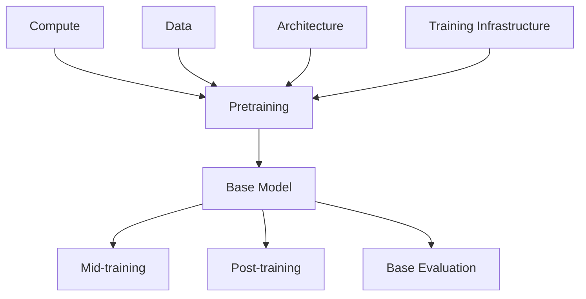

# Pretraining
From Raw Tokens to Base Model
> 中文直觉解释：Pretraining 是让模型先学会语言、知识、代码、数学和基础推理模式，产出一个还没被充分对齐、但已经具备通用能力的 base model。

## Table of Contents

- [TL;DR](#tldr)
- [Definition](#definition)
- [Pipeline Position](#pipeline-position)
- [Core Question](#core-question)
- [What Pretraining Produces](#what-pretraining-produces)
- [Core Pretraining Workstreams](#core-pretraining-workstreams)
- [DeepSeek-V4 Case Study](#deepseek-v4-case-study)
- [System View](#system-view)
- [Common Misunderstandings](#common-misunderstandings)
- [Recruiting Translation](#recruiting-translation)
- [Future Learning Slots](#future-learning-slots)
- [Simple Analogy](#simple-analogy)
- [Sources](#sources)
- [Open Questions](#open-questions)

## TL;DR

Pretraining 是现代 LLM 工业链路里最重、最贵、最基础的一段。它把一个随机初始化的 neural network，训练成能预测下一个 token 的 base model。这个 base model 还不一定会好好聊天，也不一定安全、听话、会调用工具，但它已经学到了语言、世界知识、代码、数学和很多隐性的 reasoning pattern。

不要把 pretraining 简化成“喂很多数据”。工业级 pretraining 至少同时包含 7 类工作：训练目标设计、优化算法、训练策略、数据课程表、并行训练算法、稳定性技巧、checkpoint & base eval 策略。

这 7 类工作共同回答一个问题：**如何在巨大算力、巨大数据和巨大模型规模下，稳定、有效、可验证地把 token 变成 base capability？**

## Definition

Pretraining 是 foundation model 的基础能力学习阶段。

```python
BaseModel = pretrain(
    model = initialized_transformer,
    data = large_scale_token_corpus,
    objective = next_token_prediction,
    optimizer = optimizer_and_training_recipe,
    infrastructure = distributed_training_system,
    schedule = training_schedule,
    eval = base_model_evaluation,
)
```

更具体地说：

```python
Pretraining = optimize(
    objective = {
        next_token_prediction,
        optional_auxiliary_objectives,
    },
    inputs = {
        web_text,
        books,
        code,
        math,
        academic_text,
        multilingual_data,
        long_context_documents,
        domain_data,
    },
    outputs = {
        base_model_checkpoint,
        tokenizer,
        training_logs,
        eval_history,
        checkpoint_candidates,
    }
)
```

## Pipeline Position



Pretraining 依赖上游四件事：

- Compute：GPU / accelerator cluster、network、storage、scheduler。
- Data：大规模语料、清洗、去重、过滤、配比。
- Architecture：Transformer、MoE、attention、normalization、positional encoding、long-context design。
- Training Infrastructure：parallelism、checkpointing、fault tolerance、optimizer state management。

Pretraining 的下游是 mid-training、post-training 和 evaluation。一个 base model 如果 pretraining 质量不够，后面的 alignment、RL、agent training 很难补回来。

## Core Question

Pretraining 最核心的问题是：

> **如何用可承受的算力和工程复杂度，把大规模 token 转化为稳定增长的 base model 能力？**

这不是单纯算法问题，也不是单纯数据问题，而是 data、optimizer、schedule、architecture、distributed infra 和 eval 共同构成的系统工程。

## What Pretraining Produces

Pretraining 产出的不是 chat model，而是 base model。

Base model 通常具备：

- language modeling ability；
- world knowledge；
- multilingual understanding；
- code pattern；
- math pattern；
- basic reasoning traces；
- long-context capability 的初始基础；
- domain knowledge 的初始覆盖。

Base model 通常还缺：

- stable instruction following；
- safety alignment；
- human preference alignment；
- reliable tool use；
- agent workflow behavior；
- product-grade refusal / formatting / tone control。

因此，Pretraining 是“能力底座”，Post-training 是“行为塑形”。两者不能互相替代。

## Core Pretraining Workstreams

工业级 pretraining 可以拆成 7 类 todo。它们不是孤立模块，而是互相耦合。

### 1. Training Objective Design

最常见目标是 next-token prediction / causal language modeling。

直觉：

```text
给定前文 tokens，预测下一个 token。
```

这个目标简单，但可扩展。它能让模型从海量文本中学习语言、知识、风格、代码结构和隐式推理模式。

有些模型会加入 auxiliary objectives，例如 Multi-Token Prediction (MTP)。MTP 的直觉是让模型不只预测下一个 token，也学习更远一点的未来 token，从而改善训练信号和预测效率。

需要判断的问题：

- 主目标是什么？
- 是否加入 auxiliary objective？
- auxiliary loss weight 如何设置？
- 这个目标是否影响最终 inference / serving？
- 目标设计是否服务 long-context、code、reasoning 或 agent 能力？

### 2. Optimization

Optimization 关注如何更新参数。

常见 optimizer 包括 AdamW、Muon 等。AdamW 是 LLM 训练中非常常见的 baseline；Muon 这类方法则试图通过不同的矩阵更新方式改善收敛速度和训练稳定性。

需要判断的问题：

- 使用什么 optimizer？
- 不同模块是否使用不同 optimizer？
- optimizer state 如何存储和切分？
- optimizer 是否改变通信、显存和 checkpoint 负担？
- 收敛速度、稳定性和实现复杂度之间如何 trade-off？

在大模型训练里，optimizer 不是一个小超参。它会直接影响 training stability、cost、wall-clock time 和 infra design。

### 3. Training Schedule

Training schedule 规定训练过程如何展开。

核心内容包括：

- learning rate warmup；
- learning rate decay；
- batch size schedule；
- context length schedule；
- curriculum schedule；
- training phase split；
- restart / rollback 策略。

学习率太激进可能导致 loss spike；太保守会浪费算力。batch size 太小会影响吞吐和稳定性；太大可能影响泛化或优化动态。context length 也通常不会一开始就拉到最大，而是逐步扩展。

需要判断的问题：

- warmup 多长？
- peak learning rate 是多少？
- decay 采用 cosine、linear 还是其他策略？
- batch size 是否逐步增大？
- context length 是固定还是 staged expansion？
- schedule 是否和 data curriculum、infra capacity、checkpoint eval 联动？

### 4. Data Curriculum

Data curriculum 不只是“有哪些数据”，而是“什么时候引入什么数据、用什么比例、服务什么能力”。

Pretraining data 通常包括：

- web text；
- books；
- code；
- math；
- academic / technical text；
- multilingual data；
- long documents；
- high-quality synthetic or filtered data；
- domain-specific data。

Curriculum 的关键是顺序和配比。例如早期可能更强调广覆盖和语言基础，后期增加更高质量、更长上下文、更强代码 / 数学 / 专业数据。Mid-training 也常作为 pretraining 之后的专项 curriculum extension。

需要判断的问题：

- 数据质量如何定义？
- 数据什么时候加入？
- 不同数据比例如何变化？
- long-context data 是否单独阶段引入？
- code / math / agentic traces 是 pretraining、mid-training 还是 post-training？
- 数据变化是否能从 eval 上看到能力变化？

### 5. Training Infra Algorithm

这一类关注“怎么把训练拆到很多卡上，并且还能稳定跑”。

常见技术包括：

- data parallelism；
- tensor parallelism；
- pipeline parallelism；
- sequence / context parallelism；
- expert parallelism；
- ZeRO / optimizer state sharding；
- activation checkpointing；
- recomputation；
- mixed precision；
- checkpoint save / load。

这些不是纯 infra 细节，而是会影响模型可训练规模、训练稳定性和成本的算法工程。

需要判断的问题：

- 模型参数、activation、optimizer state 如何切分？
- 长上下文 attention 如何并行？
- MoE expert 如何分布？
- checkpoint 多久保存一次？
- 某个 parallelism strategy 是否引入通信瓶颈？
- infra algorithm 是否和 architecture / optimizer 强耦合？

### 6. Stability Tricks

大规模 pretraining 的现实是：训练会出问题。

常见问题包括：

- loss spike；
- gradient explosion；
- NaN / Inf；
- router collapse；
- hot experts；
- attention instability；
- data contamination or bad batch；
- checkpoint corruption；
- hardware failure。

因此需要 stability tricks：

- loss spike detection；
- bad batch detection；
- rollback；
- gradient clipping；
- activation / logit clamping；
- router stabilization；
- expert load balancing；
- deterministic kernels；
- training health dashboard。

稳定性技巧不是“小补丁”。在 trillion-scale 训练里，它们决定一次训练能不能从头跑到尾。

### 7. Checkpoint & Base Eval Strategy

Pretraining 不是训练完才评估。训练过程中需要持续评估 checkpoint，判断 base model 是否真的变强。

Base eval 通常覆盖：

- world knowledge；
- language understanding；
- reasoning；
- code；
- math；
- long-context；
- multilingual；
- safety / toxicity early signals；
- contamination checks。

Checkpoint strategy 需要回答：

- 多久保存一次 checkpoint？
- 哪些 checkpoint 进入 full eval？
- eval 结果如何影响继续训练、rollback 或 schedule 调整？
- base model 的能力增长是否符合 scaling expectation？
- 是否出现某类能力提升、另一类能力退化？
- 哪个 checkpoint 进入 mid-training / post-training？

这是 pretraining 和 evaluation 的接口。没有 base eval，团队只能看 loss；但 loss 下降不等于模型在关键能力上真的变强。

## DeepSeek-V4 Case Study

DeepSeek-V4 是一个很适合观察现代 pretraining recipe 的案例，因为它把 architecture、optimizer、long-context schedule、MoE stability、data curriculum 和 base eval 都放在同一个系统里讨论。

下面不是要把 DeepSeek-V4 当成唯一标准，而是用它帮助建立工业直觉。

| Workstream | DeepSeek-V4 Signal | Why It Matters |
| --- | --- | --- |
| Training Objective | 保留 Multi-Token Prediction；MTP loss weight 大部分训练阶段设为 0.3，学习率衰减阶段降到 0.1 | objective 不只是 next-token prediction，也可以服务更强预测信号和训练效率 |
| Optimization | 大部分参数使用 Muon，embedding、prediction head、RMSNorm 等模块仍使用 AdamW | optimizer 可以按模块拆分，影响收敛、稳定性和 optimizer state infra |
| Training Schedule | V4-Flash warmup 2000 steps，学习率峰值 2.7e-4，最后 cosine decay 到 2.7e-5；训练序列长度从 4K 逐步扩到 16K、64K、1M | schedule 把优化动态、长上下文能力和训练成本连接起来 |
| Data Curriculum | 预训练超过 32T 高质量 tokens，覆盖数学、代码、网页、长文档等；mid-training 阶段加入 agentic data 强化 coding 能力 | 数据课程表决定 base capability 的能力结构，也决定哪些能力留到 mid-training / post-training 继续强化 |
| Training Infra Algorithm | 为 Muon 设计 hybrid ZeRO；为长上下文 attention 设计 two-stage contextual parallelism | optimizer、long context 和 distributed infra 需要协同设计 |
| Stability Tricks | 针对 trillion-parameter MoE instability，使用 Anticipatory Routing 和 SwiGLU Clamping 缓解 loss spikes | trillion-scale MoE 的难点不只是参数多，而是训练稳定 |
| Checkpoint & Base Eval | base eval 覆盖 world knowledge、language understanding & reasoning、coding/math、long-context 四类 | checkpoint 选择必须依赖能力评估，而不只是训练 loss |

可以把 DeepSeek-V4 的 pretraining 心智压缩成一句话：

> **现代 pretraining 不只是“更大模型 + 更多 token”，而是 objective、optimizer、schedule、data curriculum、infra algorithm、stability 和 eval 的联合设计。**

## System View

Pretraining 是一个闭环系统：

```text
Data Pipeline
  -> Training Objective
  -> Distributed Training System
  -> Checkpoints
  -> Base Eval
  -> Schedule / Data / Stability Adjustment
  -> Better Checkpoint
```

从系统角度看：

- Data 决定模型看到什么。
- Objective 决定模型从数据中学什么信号。
- Optimizer 决定参数如何更新。
- Schedule 决定训练如何分阶段推进。
- Infra algorithm 决定训练能不能扩展到目标规模。
- Stability tricks 决定训练能不能稳定跑完。
- Base eval 决定团队是否知道模型真的变强。

## Common Misunderstandings

- Pretraining 不等于“喂很多数据”。数据只是其中一部分，optimizer、schedule、infra、stability 和 eval 同样关键。
- Base model 不等于 chat model。base model 有能力底座，但还没有稳定 instruction following 和 safety alignment。
- Loss 下降不等于能力全面变强。需要 base eval 判断 world knowledge、reasoning、code、math、long-context 等能力。
- Data curriculum 不等于 data mixture。curriculum 还包括训练阶段和数据引入顺序。
- Training infra algorithm 不是纯工程细节。parallelism、ZeRO、activation checkpointing 会影响可训练规模和成本。
- Stability tricks 不是“训练失败后的补救”，而是大规模训练 recipe 的组成部分。
- Pretraining、mid-training、post-training 不能混为一谈。它们服务的能力和训练信号不同。

## Recruiting Translation

### Candidate Signals

Strong signals：

- 能把 pretraining 拆成 objective、optimizer、schedule、data curriculum、infra、stability、eval，而不是只说“训练大模型”。
- 做过大规模 distributed training、optimizer state sharding、checkpointing、loss spike debugging。
- 能解释 learning rate schedule、batch size、context length schedule 对训练稳定性和成本的影响。
- 理解 data mixture 和 data curriculum 的区别。
- 能讲清 base eval 为什么不能只看 loss。
- 对 MoE、long-context、context parallelism、expert parallelism 有实际经验。

Weak signals：

- 只熟悉小规模 fine-tuning，不理解 pretraining 的系统瓶颈。
- 只会讲 AdamW、batch size 等名词，讲不出它们如何影响 infra 和 stability。
- 把 eval 当作训练结束后的报告，而不是训练过程中的控制信号。

Risk signals：

- 过度相信“更多 token 一定更好”，忽略数据质量、重复、污染和 curriculum。
- 忽略 checkpoint strategy，无法解释如何选择进入 post-training 的 base model。
- 对 loss spike、rollback、bad data batch、hardware fault 没有处理经验。
- 把 DeepSeek / OpenAI / Anthropic 的 recipe 当成可直接复制的固定答案，而不是系统 trade-off。

### Role / Team Mapping

| Role | Main Ownership |
| --- | --- |
| Pretraining researcher | objective、optimizer、schedule、scaling behavior |
| Data engineer / data researcher | corpus、filtering、dedup、mixture、curriculum |
| Training infra engineer | parallelism、ZeRO、checkpoint、fault tolerance |
| GPU systems engineer | kernels、communication、memory、throughput |
| Eval engineer | base eval、regression eval、checkpoint comparison |
| Model architect | architecture choices that change trainability and scaling |

### Pre-talk Questions

- 你怎么解释 pretraining 和 post-training 的区别？
- 为什么 next-token prediction 这么简单的目标能学到通用能力？
- Data mixture 和 data curriculum 有什么区别？
- 如果训练 loss 持续下降，但 base eval 不涨，你会怀疑什么？
- Learning rate warmup / decay、batch size schedule、context length schedule 分别解决什么问题？
- 为什么大规模 MoE pretraining 容易不稳定？
- ZeRO、context parallelism、expert parallelism 分别在解决什么资源瓶颈？
- 你会如何设计 checkpoint & base eval 策略？
- 如果某个 checkpoint code 能力涨了但 world knowledge 降了，你会怎么判断是否进入 post-training？

## Future Learning Slots

这篇文档先作为 Pretraining 主入口，后续可以继续补：

### Objective Variants

- Multi-Token Prediction；
- span corruption；
- multimodal pretraining objectives；
- retrieval-augmented objectives；
- tool / code execution traces。

### Optimizers

- AdamW；
- Muon；
- Shampoo / second-order family；
- optimizer state sharding；
- optimizer stability diagnostics。

### Schedule Design

- warmup；
- cosine decay；
- batch size scaling；
- context length expansion；
- staged training；
- restart and rollback。

### Data Curriculum

- web / code / math / books / academic；
- long-context documents；
- multilingual schedule；
- synthetic data；
- agentic data boundary with mid-training。

### Stability

- loss spike analysis；
- MoE routing stability；
- activation clamping；
- gradient clipping；
- bad batch detection；
- deterministic replay。

### Base Eval

- world knowledge；
- language understanding；
- reasoning；
- code / math；
- long-context；
- contamination；
- checkpoint selection。

## Simple Analogy

Pretraining 像建一所大型综合大学的基础教育系统。

训练目标是考试规则，数据是教材和课程，optimizer 是学习方法，schedule 是学期安排，training infra 是学校的教室和管理系统，stability tricks 是防止教学秩序崩掉的机制，checkpoint & eval 是阶段考试。

最后得到的 base model 像一个基础知识很强、但还没接受职业训练和行为规范训练的学生。Post-training 才会把它训练成会按指令工作、会遵守规则、会使用工具的产品模型。

## Sources

- [DeepSeek-V4-Pro model card and technical report link](https://huggingface.co/deepseek-ai/DeepSeek-V4-Pro)
- [DeepSeek-V4 Technical Report PDF](https://huggingface.co/deepseek-ai/DeepSeek-V4-Pro/blob/main/DeepSeek_V4.pdf)
- [Hugging Face Transformers: DeepSeek-V4 architecture notes](https://huggingface.co/docs/transformers/main/model_doc/deepseek_v4)
- [DeepSeek-V3 Technical Report](https://arxiv.org/abs/2412.19437)
- [DeepSeekMath: Pushing the Limits of Mathematical Reasoning in Open Language Models](https://arxiv.org/abs/2402.03300)

## Open Questions

- Multi-Token Prediction 在大规模 pretraining 中的收益主要来自更强训练信号，还是更好的 representation？
- Muon 这类 optimizer 是否会成为 trillion-scale training 的常规选项？
- Context length schedule 应该如何和 data curriculum 共同设计？
- Long-context pretraining 和 long-context post-training 的能力边界在哪里？
- Base eval 应该如何区分“知识更多”与“推理更强”？
- 数据课程表中 agentic data 应该放在 pretraining、mid-training 还是 post-training？
- MoE routing stability 的最佳实践会不会成为 pretraining infra 的核心壁垒？
