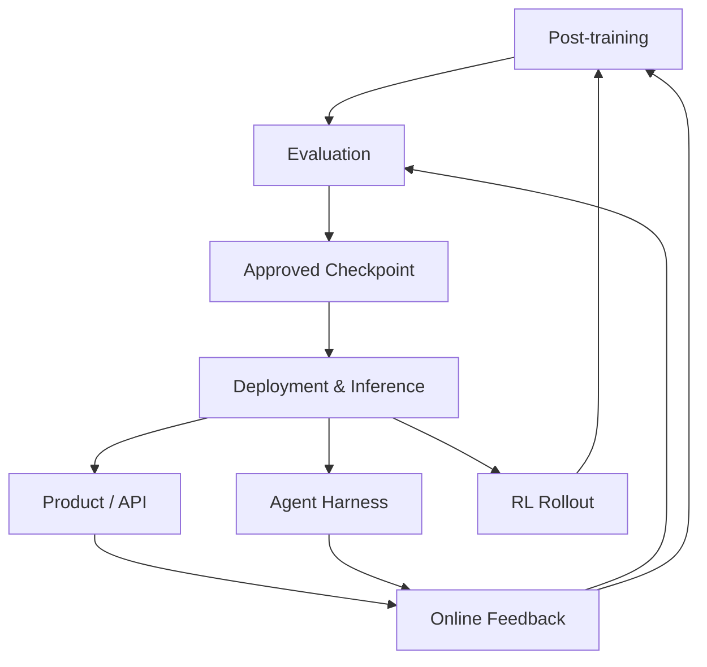

# Deployment & Inference
Industrial Serving Loop: from Model Checkpoint to Product Capability
> 中文直觉解释：推理不是“模型跑起来”，而是把训练好的模型变成可被产品、Agent、API 和 RL rollout 稳定消费的生产能力。

## Table of Contents

- [TL;DR](#tldr)
- [Definition](#definition)
- [Pipeline Position](#pipeline-position)
- [Core Question](#core-question)
- [Industrial Loop View](#industrial-loop-view)
- [Team Ownership Map](#team-ownership-map)
- [Foundation Model Inference](#foundation-model-inference)
- [Platform / Cloud Inference](#platform--cloud-inference)
- [Application Inference](#application-inference)
- [Runtime Mechanism](#runtime-mechanism)
- [Deployment Control Plane](#deployment-control-plane)
- [Serving Engines](#serving-engines)
- [Workload Patterns](#workload-patterns)
- [System View](#system-view)
- [Common Misunderstandings](#common-misunderstandings)
- [Recruiting Translation](#recruiting-translation)
- [Simple Analogy](#simple-analogy)
- [Sources](#sources)
- [Open Questions](#open-questions)

## TL;DR

大模型 inference 的工业含义是：模型完成训练和评测之后，如何在真实流量、真实成本、真实 SLA 下持续对用户提供能力。它不只是一次 forward pass，也不只是 vLLM / SGLang / TensorRT-LLM 的使用经验，而是一套把 checkpoint 变成 product capability 的生产系统。

大公司里会有多个团队同时做“推理”，因为他们优化的对象不同：

- Foundation model inference：让自研基座模型跑得快、稳、省，并把模型原生推理能力沉淀给内部复用。
- Platform / cloud inference：把多模型、多硬件、多租户、多环境的部署能力做成平台或云产品。
- Application inference：围绕微信搜索、元宝、Agent、广告、客服等业务，把混元、DeepSeek、开源模型、自研小模型组合进真实产品链路。

所以不要把推理理解成一个单点技术岗位。更准确的理解是：**推理是一个跨模型、平台、应用的工业闭环；不同团队在闭环里拥有不同控制点。**

这篇文档采用 loop engineering 视角：先看线上 workload 和指标，再定位瓶颈，选择模型 / runtime / deployment / routing / cache / quantization / 后训练策略，最后通过 eval、canary、A/B、online feedback 验证并回流。技术框架只是 loop 里的工具，不是理解推理组织的起点。

## Definition

Deployment 是生产控制面：

```python
DeploymentPlatform = operate_model_service(
    model_artifact = {
        "checkpoint": approved_checkpoint,
        "tokenizer": tokenizer_version,
        "model_config": architecture_config,
        "quantization": precision_or_quantization_plan,
        "eval_report": release_gate_result,
    },
    control_plane = {
        "gateway": auth_rate_limit_quota,
        "routing": model_version_region_runtime_selection,
        "release": canary_ab_test_rollback,
        "scaling": capacity_planning_autoscaling,
        "observability": metrics_logs_traces_cost,
        "slo": latency_availability_error_budget,
    },
    consumers = ["product", "API", "agent", "batch_job", "RL_rollout"],
)
```

Inference 是模型执行面：

```python
InferenceRuntime = execute_model(
    weights = loaded_model_weights,
    requests = scheduled_requests,
    execution = {
        "tokenization": input_output_tokens,
        "prefill": prompt_processing_and_kv_creation,
        "decode": autoregressive_generation,
        "kv_cache": memory_management_and_reuse,
        "batching": continuous_or_static_batching,
        "sampling": temperature_top_p_beam_or_constrained_decoding,
        "parallelism": tensor_pipeline_data_expert_context_parallelism,
        "streaming": token_stream_to_client,
    },
    objectives = ["low_TTFT", "stable_P99", "high_tokens_per_second", "low_cost_per_token"],
)
```

工业界的完整服务链路通常是：

```text
Product / API / Agent Request
  -> Gateway / Auth / Rate Limit
  -> Routing / Model Selection
  -> Deployment Control Plane
  -> Inference Runtime
  -> GPU / AI Accelerator Execution
  -> Response / Stream / Tool Call / Rollout
  -> Logs / Metrics / Feedback
  -> Eval / Post-training / Routing / Runtime Optimization
```

## Pipeline Position



Deployment & Inference 位于 Evaluation 之后、Product / Agent / Online Feedback 之前。它是模型能力进入真实世界的入口，也是线上问题反向影响 evaluation、post-training、architecture 和 data 的出口。

它向上依赖：

- Architecture：dense、MoE、GQA / MQA / MLA、long context、multimodal 都会改变 serving 策略。
- Training Infrastructure：checkpoint 格式、parallelism plan、precision、LoRA / adapter、模型切分方式会影响加载和部署。
- Evaluation：release gating、regression eval、safety eval 决定模型能否进入 canary。

它向下影响：

- Product：用户感知 latency、streaming、稳定性、错误率和成本。
- Agent：tool calling、long trajectory、structured output、sandbox latency 会放大推理复杂度。
- Online Feedback：线上失败、A/B、用户偏好、成本曲线会反过来驱动 eval、post-training 和 serving 改造。

## Core Question

Deployment & Inference 的核心问题不是：

> 这个模型能不能跑？

而是：

> **如何让合适的模型，在合适的流量上，以合适的成本和 SLA，持续产生可验证的产品价值？**

这句话里有 5 个关键词：

| Keyword | Meaning |
| --- | --- |
| 合适的模型 | 混元、DeepSeek、Qwen、Llama、自研小模型、embedding、reranker、reward model 都可能被组合使用。 |
| 合适的流量 | 搜索、对话、Agent、长文档、客服、广告、代码、RL rollout 的 workload shape 不同。 |
| 合适的成本 | GPU 利用率、tokens/sec、KV cache、batch、量化、路由和 fallback 共同决定成本。 |
| SLA | TTFT、P99、timeout、availability、error budget 和降级策略决定能不能上线。 |
| 可验证价值 | 业务指标、用户体验、eval regression、A/B test 和 online feedback 要闭环。 |

## Industrial Loop View

Karpathy 的 Software 2.0 视角里，软件不再只靠人手写规则，而是通过数据、目标和评测来迭代模型行为；Software 3.0 / vibe coding 进一步把人的工作推向“表达意图、组织上下文、验证输出、驱动下一轮修改”。迁移到推理系统，关键不是背框架，而是建立一个可重复运行的工程闭环。

一个工业推理 loop 可以这样设计：

```text
1. Observe workload
   看真实请求：QPS、tokens、context length、tool calls、traffic spike、tenant、model mix。

2. Define SLO and cost target
   明确 TTFT、P99、availability、cost per 1M tokens、GPU utilization、业务指标。

3. Diagnose bottleneck
   判断瓶颈在 routing、queue、prefill、decode、KV cache、network、expert routing、tool latency 还是产品链路。

4. Choose intervention
   改模型、改 runtime、改 batch、改 cache、改 quantization、改 routing、改 prompt、改后训练、改产品链路。

5. Verify offline
   用 replay traffic、benchmark、regression eval、safety eval、load test 先验证。

6. Release online
   shadow traffic -> 1% canary -> 5% canary -> A/B test -> full rollout。

7. Feed back
   把失败 case、成本曲线、latency profile、用户反馈回流到 eval、post-training、architecture 和 serving roadmap。
```

这个 loop 的重点是：**推理优化不是单次调参，而是把产品反馈、系统指标、模型行为放进同一个迭代系统。**

对应到组织：

| Loop Step | Foundation Model Team | Platform / Cloud Team | Application Team |
| --- | --- | --- | --- |
| Observe workload | 看模型结构瓶颈、token 分布、架构限制 | 看多租户流量、集群利用率、容量水位 | 看业务链路、用户请求、Agent trajectory |
| Define target | tokens/sec、显存、长上下文、MoE efficiency | SLA、GPU utilization、部署效率、单位成本 | 搜索质量、响应延迟、用户满意、业务转化 |
| Diagnose | kernel、KV cache、parallelism、precision | autoscaling、routing、quota、observability | model routing、RAG、prompt、cache、fallback |
| Intervene | 量化、spec decoding、kernel、结构适配 | 平台能力、调度、灰度、监控、计费 | 多模型编排、业务 cache、后训练协同 |
| Verify | model benchmark、runtime benchmark | load test、canary、SLO dashboard | A/B test、task eval、线上失败分析 |
| Feed back | 影响 architecture / post-training | 影响平台 roadmap | 影响产品策略 / eval / data |

## Team Ownership Map

大厂里同样叫“大模型推理工程师”，实际可能属于三个层级。

### 三层分工

| Layer | Core Ownership | Typical Teams | Main Question |
| --- | --- | --- | --- |
| Foundation Model Inference | 自研基座模型的原生推理能力 | 混元、GPT、Gemini、Claude、Qwen、DeepSeek 模型团队 | 这个模型本身怎样跑到极致？ |
| Platform / Cloud Inference | 通用推理平台、资源调度、部署控制面 | 腾讯云、内部 AI platform、MaaS、SRE / infra | 多模型多业务怎样规模化服务？ |
| Application Inference | 业务场景里的模型组合和推理链路 | 微信搜索、元宝、广告、客服、Agent 产品 | 这个业务怎样用模型产生价值？ |

### 四种组织模式

| Pattern | Description | Strength | Risk |
| --- | --- | --- | --- |
| 基模主导型 | 基模团队负责完整推理栈，应用只调 API | 标准统一、模型适配深 | 应用响应慢，场景定制不足 |
| 应用主导型 | 基模交付模型，应用自己做部署和优化 | 贴近业务、迭代快 | 重复建设，推理栈碎片化 |
| 平台中台型 | 基模做模型原生优化，平台做通用底座，应用做场景适配 | 大厂长期最常见 | 边界和优先级需要治理 |
| 联合小队型 | 战略业务中基模、平台、应用、算法组成虚拟团队 | 适合关键战役 | 对协作和 owner 要求高 |

一句话记忆：

> **基模管“模型怎么跑”，平台管“模型在哪里跑”，应用管“模型为什么这样跑”。**

## Foundation Model Inference

Foundation model inference 团队的出发点是模型本身，典型工作是把自研模型的结构、权重、精度、并行策略、runtime 和硬件协同优化。

如果以混元这类团队为例，它通常主要围绕自研基座模型搭建 inference system，例如长上下文、多模态、MoE、reasoning model、HY 系列模型等。同时，它沉淀出来的 runtime 适配、量化方案、benchmark、部署规范和 profiling 工具，会被元宝、微信、云、CSIG 或其他内部团队复用。

典型职责：

- 模型结构适配：MoE、GQA / MLA、long context、multimodal encoder、reasoning decode pattern。
- Runtime 二次开发：vLLM、SGLang、TensorRT-LLM、Triton backend、内部 serving engine。
- GPU / kernel 优化：CUDA / Triton kernel、FlashAttention / FlashInfer、GEMM、operator fusion。
- 分布式推理：TP、PP、DP、EP、CP、KV cache transfer、multi-node communication。
- 模型压缩：INT8、FP8、AWQ、GPTQ、SmoothQuant、KV cache quantization。
- 模型 release 支撑：benchmark、性能报告、serving recipe、deployment guide。

核心指标：

- tokens/sec；
- TTFT / TPOT；
- P95 / P99 latency；
- GPU memory utilization；
- cost per token；
- max context length；
- multi-node scaling efficiency；
- quality drop under quantization。

候选人强信号：能讲清某个模型结构为什么影响 serving，而不是只说“我会 vLLM”。例如 MoE 为什么有 expert parallelism 和 all-to-all，长上下文为什么 prefill 和 KV cache 压力大，reasoning model 为什么 decode token budget 会改变成本曲线。

## Platform / Cloud Inference

Platform / cloud inference 团队的出发点是规模化服务。它不只服务一个模型，也不只服务一个业务，而是要把推理能力做成内部平台或外部云产品。

典型职责：

- Model registry：checkpoint、tokenizer、config、quantization、eval report、owner 可追踪。
- Endpoint lifecycle：创建、发布、升级、下线、回滚。
- Multi-model serving：混元、DeepSeek、Qwen、Llama、客户私有模型、embedding、reranker。
- Multi-hardware support：NVIDIA GPU、AMD GPU、国产 AI 芯片、CPU / edge 环境。
- Scheduling and autoscaling：容量规划、弹性、资源池、水位、优先级、抢占。
- Gateway and quota：auth、rate limit、tenant isolation、token budget、abuse prevention。
- Observability：metrics、logs、traces、cost dashboard、incident response。
- Enterprise delivery：公有云、私有化、专有云、混合云、客户环境适配。

核心指标：

- deployment lead time；
- endpoint availability；
- fleet GPU utilization；
- tenant isolation；
- cost per 1M tokens；
- SLA compliance；
- failure recovery time；
- model / hardware coverage。

候选人强信号：能讲清“平台化”和“单业务上线”的区别。比如为什么云平台要关心多租户隔离、客户私有模型、不同硬件、计费、审计、配额，而应用团队通常更关心某条业务链路的效果和延迟。

## Application Inference

Application inference 团队的出发点是真实业务。它会同时使用 foundation model、开源模型、自研小模型、embedding、reranker、reward model 和工具系统，并围绕业务链路做二次推理优化。

以微信搜索、元宝、AI Search、Agent 产品为例，应用团队不一定只用混元。它可能混合使用：

- 混元等内部 foundation model；
- DeepSeek / Qwen / Llama 等开源或开放权重模型；
- 微信自研 WeLM / 搜索模型 / 排序模型；
- embedding / reranker / classifier / small LLM；
- VLM、OCR、ASR、TTS 或其他多模态模型。

典型职责：

- 模型路由：简单请求走 cheap model，复杂请求走 strong model。
- 业务 cache：热点 query cache、result cache、prompt cache、prefix cache、session cache。
- RAG / Search integration：query understanding、retrieval、reranking、summary、answer generation。
- Agent serving：tool schema、structured output、sandbox result、multi-turn state、fallback。
- Latency budget：把搜索、召回、排序、LLM 生成、工具调用放进总延迟预算。
- 降级策略：超时切小模型、切模板、切传统搜索、切缓存答案。
- 后训练协同：用业务失败 case、格式错误、工具调用失败、用户反馈驱动 SFT / RL / eval。

核心指标：

- product latency / P99；
- task success rate；
- search quality / answer quality；
- user satisfaction；
- conversion / retention；
- model cost per session；
- fallback rate；
- tool-call success rate。

候选人强信号：能把 inference 和业务指标连接起来。比如“搜索问答慢”不只可能是 GPU 慢，也可能是 retrieval 慢、prompt 太长、reranker 太重、模型路由不合理、tool schema 太复杂、fallback 没设计好。

## Runtime Mechanism

### Prefill and Decode

LLM inference 通常分为两个阶段：

| Stage | Intuition | System Pressure | User Perception |
| --- | --- | --- | --- |
| Prefill | 读题，把 prompt / context 处理完并建立 KV cache | 计算密集，受 input length 影响大 | 首 token 等多久，即 TTFT |
| Decode | 作答，一个 token 一个 token 生成 | 延迟敏感，受调度和 KV cache 影响大 | 流式输出是否顺滑 |

长文档、代码仓库、RAG、Agent memory 会放大 prefill；reasoning、multi-step agent、长回答会放大 decode。

### KV Cache

Transformer 自回归生成时，需要复用历史 token 的 Key / Value。KV cache 的作用是避免每生成一个新 token 都重新计算前文。

KV cache 直接影响：

- 显存占用；
- batch size 上限；
- long-context 成本；
- decode latency；
- prefix reuse；
- multi-turn conversation 成本；
- multi-tenant serving 的容量规划。

### Continuous Batching

LLM 请求长度不同、到达时间不同、结束时间不同。Continuous batching 在每个 decode step 动态加入新请求、移除已完成请求，让 GPU 尽量保持忙碌。

它解决的是 GPU utilization 问题，但也会引入调度复杂度。吞吐、排队时间、tail latency 和 fairness 需要一起看。

### Prefix Cache

很多请求共享 prefix：

- system prompt；
- tool schema；
- RAG 文档片段；
- agent scaffold；
- 多轮对话历史；
- parallel sampling 的共同前缀。

Prefix cache 的目标是复用已经 prefill 过的共享前缀。对 Agent、RAG、long-context QA、RL rollout 都很重要。

### Structured Generation

业务系统和 Agent 往往需要 JSON、function call、XML、DSL 或 schema-constrained output。Structured generation / constrained decoding 的价值是降低 parse error、tool-call error 和业务链路不确定性。

### Speculative Decoding

Speculative decoding 用一个更小或更快的 draft model 先生成候选 token，再由 target model 验证。目标是在质量基本不变的情况下减少 decode latency。它的收益取决于 draft model 命中率、验证成本、batch shape 和 serving 集成。

### Quantization

量化通过降低权重或激活精度减少显存和计算成本。常见方向包括 INT8、FP8、AWQ、GPTQ、SmoothQuant、KV cache quantization。真正上线时要同时看：

- latency / throughput 收益；
- 显存收益；
- 质量损失；
- 长上下文稳定性；
- 不同模型结构的适配成本；
- 硬件支持。

## Deployment Control Plane

Deployment control plane 是模型服务的生产外壳。

### Model Registry

上线前要明确：

- checkpoint 版本；
- tokenizer 版本；
- model config；
- precision / quantization；
- adapter / LoRA；
- prompt / safety config；
- eval report；
- release owner。

如果没有 registry，线上 regression 很难定位是模型、tokenizer、prompt、runtime、routing 还是配置变了。

### Gateway, Auth, Rate Limit

LLM rate limit 不只是 QPS，还要看：

- input tokens；
- output tokens；
- context length；
- tool calls；
- tenant budget；
- priority；
- abuse pattern。

### Routing and Model Selection

Routing 决定请求去哪个模型、哪个版本、哪个 region、哪个 runtime、哪个硬件池。它是应用推理和平台推理之间最重要的接口之一。

典型策略：

- cheap / fast / strong tier；
- simple / complex query classifier；
- fallback on timeout；
- canary traffic split；
- region / capacity aware routing；
- user / tenant policy；
- model quality / cost trade-off。

### Canary, Rollback, A/B Test

生产发布通常不是直接 100% 放量：

```text
offline eval
  -> replay traffic
  -> shadow traffic
  -> 1% canary
  -> 5% canary
  -> A/B test
  -> full rollout
```

如果 P99、error rate、safety incident、user satisfaction 或 cost 变差，需要 rollback。

### Observability and SLO

LLM service 至少要看：

- Time To First Token；
- inter-token latency；
- P50 / P95 / P99 latency；
- request throughput；
- output tokens/sec；
- error rate / timeout rate；
- queue length；
- GPU utilization；
- KV cache hit rate；
- cost per 1M tokens；
- canary vs stable comparison。

只看平均 latency 会误导判断。用户体验、Agent reliability 和业务稳定性往往由 tail latency 决定。

## Serving Engines

常见 serving systems 可以粗略理解如下：

| System | Core Positioning | Typical Use |
| --- | --- | --- |
| vLLM | 通用高吞吐 LLM serving engine | chat API、RAG、batch generation、OpenAI-compatible API |
| SGLang | 复杂 LLM workload runtime | agent、structured generation、MoE、RL rollout、prefix-heavy workload |
| TensorRT-LLM | NVIDIA GPU 深度优化 inference stack | NVIDIA production environment、极致性能和图优化 |
| Triton Inference Server | 通用 inference server / MLOps integration | multi-framework serving、Kubernetes、Prometheus、enterprise deployment |
| TGI | Hugging Face 生态 model serving | Hugging Face model deployment |
| LMDeploy | 中文和开源模型部署生态 | 量化、TurboMind、国内模型部署 |
| llama.cpp / Ollama | 本地和边缘推理 | Mac / PC、本地小模型、隐私和开发者体验 |

### vLLM

vLLM 的核心心智是：**通用高吞吐 LLM serving 标准件**。

关键技术包括：

- PagedAttention：把 KV cache 类比成分页内存来管理，减少显存碎片。
- Continuous batching：动态调度请求，提高 GPU 利用率。
- Prefix caching：复用共享 prompt 前缀。
- OpenAI-compatible API：降低接入成本。

适合判断的问题：候选人是否能解释 KV cache 管理为什么比“把模型加载到 GPU”更关键。

### SGLang

SGLang 的核心心智是：**复杂 LLM 程序的高性能执行系统**。

关键技术和场景包括：

- RadixAttention / prefix reuse；
- structured generation；
- agent workflow；
- MoE serving；
- prefill-decode disaggregation；
- RL rollout backend。

适合判断的问题：候选人是否能解释 workload shape，比如 tool schema 复用、parallel sampling、long trajectory、MoE expert routing，而不是只背项目名。

### vLLM vs SGLang

| Dimension | vLLM | SGLang |
| --- | --- | --- |
| Core Mindset | 高吞吐通用 serving engine | 复杂 LLM workload runtime |
| Representative Techniques | PagedAttention, continuous batching, prefix caching | RadixAttention, structured generation, disaggregation, MoE serving |
| Strong Use Cases | chat API, RAG, high-concurrency serving, batch generation | agent workflow, structured generation, MoE, RL rollout |
| Recruiting Lens | 看候选人是否懂 KV cache、batching、latency / throughput | 看候选人是否懂 workload 编排、prefix reuse、agent / RL / MoE |

不要把这个对比写死。两个项目都在快速演进，功能边界会互相靠近。招聘时更重要的是候选人能否从 workload 出发解释为什么选某个 runtime。

## Workload Patterns

| Pattern | Main Pressure | Typical Owner |
| --- | --- | --- |
| Single-model API serving | 基础稳定性、成本、OpenAI-compatible API | Platform / application |
| Multi-model routing | 模型选择、fallback、成本质量平衡 | Application + platform |
| Long-context serving | prefill、KV cache、admission control | Foundation + runtime |
| RAG serving | retrieval latency、prompt length、answer quality | Application |
| Agent serving | structured output、tool latency、session state、prefix reuse | Application + agent infra |
| MoE serving | expert placement、all-to-all、load balance | Foundation + runtime |
| RL rollout serving | token throughput、sample diversity、policy freshness | Post-training + runtime |
| Cloud / enterprise serving | 多租户、多模型、多硬件、审计和交付 | Platform / cloud |
| Local / edge inference | 内存、离线、隐私、开发体验 | Product / edge platform |

## System View

Deployment & Inference 是多条链路的交汇点：

```text
Architecture
  -> 决定模型结构约束和 runtime 适配难度

Evaluation
  -> 决定 release gating 和 regression 风险

Deployment Platform
  -> 控制 gateway / routing / scaling / observability / rollback

Inference Runtime
  -> 执行 prefill / decode / KV cache / batching / sampling

Application / Agent
  -> 产生真实 workload、业务指标和失败案例

Online Feedback
  -> 回流到 eval、post-training、routing、runtime 和产品策略
```

强系统视角要同时回答：

- 这个模型版本是否应该上线？
- 它应该服务哪些流量？
- 请求如何被路由、限流和降级？
- runtime 如何保证 latency、throughput 和 cost？
- 出问题如何发现、止血和回滚？
- 线上数据如何进入 eval / post-training / online feedback？

## Common Misunderstandings

- Deployment 不等于 inference。Deployment 是生产控制面，Inference 是模型执行面。
- Inference 不等于一次 forward。真实 serving 包括 scheduling、batching、KV cache、streaming、parallelism 和 observability。
- 基模推理、平台推理、应用推理不是重复岗位，而是不同 ownership。
- 应用团队不会只用一个基座模型。真实业务经常混用内部模型、开源模型、小模型和工具链。
- vLLM / SGLang 不是“谁更先进”的问题，而是 workload shape 和组织 owner 的问题。
- 只看 benchmark 吞吐不够。真实线上要看 P99、TTFT、cost、error、fallback 和业务指标。
- RL 不只是训练问题。大规模 rollout 本身就是 inference scaling 问题。
- 推理优化不总是底层 kernel 优化。有时最有效的是 routing、cache、prompt、后训练或产品链路改造。

## Recruiting Translation

### Candidate Signals

Strong signals：

- 能把 foundation model inference、platform inference、application inference 的边界讲清楚。
- 能解释一个模型从 checkpoint 到 canary 的生产流程。
- 能讲清 prefill vs decode、KV cache、continuous batching、prefix cache。
- 做过 vLLM、SGLang、TensorRT-LLM、Triton、TGI 或自研 serving stack，并能说明改动点。
- 理解 latency / throughput / cost / GPU utilization / quality 的 trade-off。
- 能从 workload 出发选择方案，而不是只背框架名。
- 有 long-context、MoE、agent、structured output、RL rollout 或大规模在线服务经验。
- 能讲清一次线上推理问题如何定位、止血、回滚和复盘。

Weak signals：

- 只会说“部署模型”，讲不清 runtime 如何调度请求。
- 只关注 QPS，不关注 TTFT、P99、KV cache 和 cost per token。
- 把应用侧 prompt / API 接入包装成底层推理优化。
- 只跑过 demo endpoint，没有 canary、rollback、observability、SLA 经验。
- 把 vLLM / SGLang / TRT-LLM 当作同质化工具，不看 workload。

Risk signals：

- 用单机 benchmark 代替真实流量判断。
- 忽略 tail latency、capacity planning 和 failure mode。
- 对 MoE / long context / agent / RL rollout 的复杂度估计过低。
- 说不清自己负责的是模型、平台、业务链路还是工具集成。

### Role / Team Mapping

| Role | Main Ownership | Interview Focus |
| --- | --- | --- |
| Foundation model inference engineer | 模型结构适配、kernel、量化、分布式推理 | 模型结构如何影响 serving？ |
| Inference runtime engineer | serving engine、KV cache、batching、scheduler | runtime 的瓶颈和 trade-off 是什么？ |
| GPU systems engineer | CUDA / Triton kernel、memory、communication | 性能 profile 如何做？ |
| Platform / cloud inference engineer | registry、endpoint、routing、autoscaling、observability | 如何把推理能力平台化？ |
| Application inference infra engineer | 多模型编排、业务 cache、fallback、A/B | 如何让业务指标变好？ |
| Agent inference engineer | tool calling、structured output、session state、sandbox | agent workload 为什么特殊？ |
| RL rollout infra engineer | rollout serving、verifier、trainer integration | rollout throughput 如何影响 post-training？ |

### Pre-talk Questions

- 你负责的推理系统服务的是 foundation model、平台，还是某个应用场景？
- 你们线上最核心的 SLO 是 TTFT、P99、tokens/sec、成本，还是业务指标？
- 一次请求从 API 入口到 GPU decode，中间经过哪些模块？
- 你做过的优化是在 routing、batching、KV cache、kernel、量化、并行、cache，还是业务链路？
- Prefill 和 decode 的瓶颈分别是什么？长上下文请求为什么会影响短请求体验？
- 你如何判断 vLLM、SGLang、TensorRT-LLM 或自研 runtime 哪个更适合？
- 如果线上 P99 突然升高，你会如何从 deployment layer 和 runtime layer 分别排查？
- 应用团队为什么还需要自己的推理工程师，而不是完全调用基模 API？
- 多模型路由如何在质量、延迟和成本之间取舍？
- 你做过的推理优化如何被验证？offline benchmark、load test、canary、A/B 各看什么？

## Simple Analogy

可以把大模型推理系统想成一个大型机场。

- Foundation model inference 像飞机制造商和发动机团队：让某一型飞机飞得更快、更省油、更适配航线。
- Platform / cloud inference 像机场和航空运营平台：管理航班、跑道、登机口、安检、调度、告警和容量。
- Application inference 像具体航线运营团队：决定北京到上海用什么机型、几点飞、票价多少、延误时怎么改签、乘客体验如何。

只懂发动机，不等于懂机场运营；只懂机场调度，也不等于懂某条航线的商业效果。真正的推理系统要把三者接起来。

## Sources

- [Andrej Karpathy: Software 2.0](https://karpathy.medium.com/software-2-0-a64152b37c35)
- [Business Insider summary of Karpathy's YC talk: keep AI on the leash](https://www.businessinsider.com/openai-cofounder-andrej-karpathy-keep-ai-on-the-leash-2025-6)
- [Sarkar and Drosos: Vibe coding, programming through conversation with artificial intelligence](https://arxiv.org/abs/2506.23253)
- [vLLM GitHub repository](https://github.com/vllm-project/vllm)
- [vLLM official documentation](https://docs.vllm.ai/)
- [vLLM: Automatic Prefix Caching](https://docs.vllm.ai/en/latest/features/automatic_prefix_caching.html)
- [SGLang documentation](https://docs.sglang.ai/)
- [SGLang GitHub repository](https://github.com/sgl-project/sglang)
- [NVIDIA TensorRT-LLM documentation](https://docs.nvidia.com/tensorrt-llm/)
- [NVIDIA Triton Inference Server documentation](https://docs.nvidia.com/deeplearning/triton-inference-server/user-guide/docs/index.html)
- [KServe documentation](https://kserve.github.io/website/)
- [Amazon SageMaker: Real-time inference](https://docs.aws.amazon.com/sagemaker/latest/dg/realtime-endpoints.html)
- [Hugging Face Text Generation Inference](https://huggingface.co/docs/text-generation-inference/index)
- [Hugging Face Transformers: Continuous batching](https://huggingface.co/docs/transformers/main/llm_optims#continuous-batching)
- Local note: `/Users/jeffersonhu/Desktop/current_chat_qa_inference.md`

## Open Questions

- Foundation model inference 和 platform inference 在不同公司里如何划边界？
- 应用团队什么时候应该复用基模底座，什么时候应该自建推理链路？
- 多模型路由应该由平台、应用还是模型团队 owner？
- Agent workload 会不会让 inference runtime 变成新的应用执行系统？
- MoE serving、long context、RL rollout 哪个会成为下一阶段推理成本主因？
- 推理优化的 ROI 应该按 tokens cost、GPU utilization、业务指标还是用户体验来排优先级？
