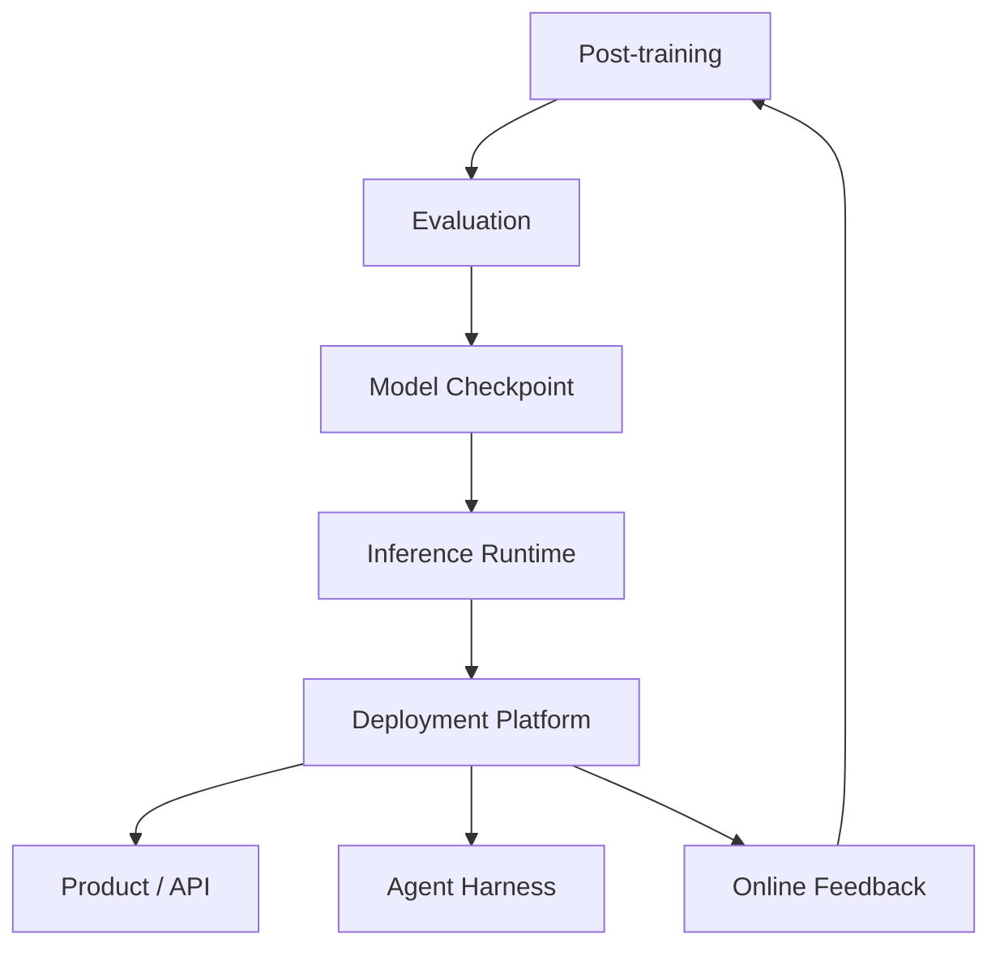

# Deployment & Inference
LLM Serving Runtime / From Checkpoint to Product Traffic
> 中文直觉解释：Deployment 是让模型稳定地服务真实用户和真实业务，Inference 是让模型真正跑起来。

## Table of Contents

- [TL;DR](#tldr)
- [Definition](#definition)
- [Pipeline Position](#pipeline-position)
- [Core Question](#core-question)
- [Inference vs Deployment](#inference-vs-deployment)
- [Core Runtime Flow](#core-runtime-flow)
- [Core System Problems](#core-system-problems)
- [Serving Engines](#serving-engines)
- [vLLM](#vllm)
- [SGLang](#sglang)
- [vLLM vs SGLang](#vllm-vs-sglang)
- [Deployment Patterns](#deployment-patterns)
- [System View](#system-view)
- [Common Misunderstandings](#common-misunderstandings)
- [Recruiting Translation](#recruiting-translation)
- [Future Learning Slots](#future-learning-slots)
- [Simple Analogy](#simple-analogy)
- [Sources](#sources)
- [Open Questions](#open-questions)

## TL;DR

Inference 不是简单地“把模型 forward 一次”。在工业系统里，Inference 是把 model checkpoint 变成可被 API、产品、agent、RAG、coding tool、RL rollout 调用的高性能执行层。

Deployment 是更大的上线工程：API gateway、鉴权、监控、日志、灰度、弹性扩缩容、SLA、成本和 A/B testing 都属于 deployment。vLLM、SGLang、TensorRT-LLM、TGI 这类系统更靠近 inference runtime / serving engine，而不是完整的 deployment platform。

现代 inference 的核心矛盾是：用户想要低延迟、流式输出、长上下文、稳定体验；系统想要高吞吐、高 GPU utilization、低显存浪费、低单位 token 成本。很多技术，例如 KV cache、continuous batching、PagedAttention、RadixAttention、prefill-decode disaggregation、MoE expert parallelism，本质上都在处理这个矛盾。

一句话记忆：**Inference 是让模型在真实流量下跑得快、稳、省；Deployment 是让这个服务可上线、可观测、可回滚、可扩展。**

## Definition

Inference 是模型执行层：

```python
InferenceRuntime = execute_model(
    checkpoint = trained_model,
    requests = user_or_agent_requests,
    runtime = {
        tokenizer,
        prefill,
        decode,
        KV_cache,
        scheduler,
        batching,
        sampling,
        streaming,
        structured_output,
    },
    objective = {
        low_latency,
        high_throughput,
        stable_P99,
        low_cost_per_token,
        high_GPU_utilization,
    }
)
```

Deployment 是上线运维层：

```python
DeploymentPlatform = operate_service(
    inference_runtime = InferenceRuntime,
    platform = {
        API_gateway,
        auth,
        routing,
        autoscaling,
        observability,
        logging,
        canary_release,
        fallback,
        cost_control,
        SLA,
    }
)
```

两者关系：

```text
Model Checkpoint
↓
Inference Runtime / Serving Engine
↓
Deployment Platform
↓
Product / Agent / API / Online Feedback
```

## Pipeline Position



Inference 位于 evaluation 之后、agent / product / online feedback 之前。它接收的是已经训练和评测过的模型 checkpoint，输出的是可被真实请求调用的 model service。

它向上依赖：

- Architecture：模型是 dense、MoE、MLA、long-context、multimodal，都会改变 serving 方式。
- Training Infrastructure：checkpoint 格式、并行策略、量化策略会影响 inference。
- Evaluation：只有通过核心 eval 和 regression test 的 checkpoint 才应该进入 serving。

它向下影响：

- Agent：agent 的多轮工具调用、长 trajectory、structured generation 会放大 serving runtime 价值。
- Online Feedback：RL rollout、线上失败挖掘、A/B test 都依赖稳定 inference。
- Product：用户直接感知 latency、流式输出、稳定性和成本。

## Core Question

Deployment & Inference 的核心问题不是“这个模型能不能跑”，而是：

> **如何让模型在真实流量、长上下文、多轮 agent、MoE 和 RL rollout 场景下，以可接受成本稳定运行？**

这也是为什么 inference infra 不只是后端工程，而是 AI Infra 的核心岗位之一。它连接 GPU systems、distributed systems、model architecture、serving platform、agent runtime 和 product reliability。

## Inference vs Deployment

Inference 更关注模型执行本身：

- prefill / decode；
- KV cache；
- batching / scheduling；
- attention kernel；
- sampling；
- streaming；
- quantization；
- structured output；
- tensor / pipeline / expert parallelism。

Deployment 更关注服务上线和运维：

- API gateway；
- auth / rate limit；
- monitoring / logging；
- autoscaling；
- canary / rollback；
- SLA / incident response；
- cost management；
- A/B testing；
- data privacy and compliance。

边界可以这样理解：

| Layer | Core Question | Typical Owner |
| --- | --- | --- |
| Inference Runtime | 模型如何被高效执行？ | Inference infra / GPU systems |
| Serving API | 请求如何进入模型服务？ | Platform / backend |
| Deployment Platform | 服务如何稳定上线和运维？ | Infra / SRE / platform |
| Product Integration | 模型如何服务用户场景？ | Product engineering / agent team |

## Core Runtime Flow

LLM inference 通常分为两个阶段：Prefill 和 Decode。

### Prefill

Prefill 是“读题”：

- 读入 prompt / context；
- 计算输入 tokens 的 hidden states；
- 建立 KV cache；
- 影响 Time To First Token。

长上下文请求，例如 100K token 文档总结，主要压力在 prefill。Prefill 通常计算量大、适合并行，但会影响首 token 等待时间。

### Decode

Decode 是“作答”：

- 基于已有 KV cache；
- 一个 token 一个 token 地生成；
- 影响 streaming smoothness；
- 对 P95 / P99 latency 很敏感。

用户看到模型开始输出后，如果中途卡顿，通常是 decode 或调度被其他 workload 打断。

| Stage | Main Work | System Property | User Perception |
| --- | --- | --- | --- |
| Prefill | 处理输入 prompt，建立 KV cache | 计算密集，适合并行 | 首 token 等多久 |
| Decode | 逐 token 生成输出 | 延迟敏感，持续调度 | 输出是否流畅 |
| Optimization Goal | throughput / TTFT | token latency / P99 | 交互体验 |

## Core System Problems

### KV Cache

Transformer 在自回归生成中需要复用历史 token 的 Key / Value。如果每生成一个新 token 都重新计算前文，会非常浪费，所以 serving engine 会保存 KV cache。

KV cache 直接影响：

- 显存占用；
- long-context 成本；
- batch size 上限；
- decode latency；
- throughput；
- prefix reuse 效率。

上下文越长、并发越高、多轮对话越多，KV cache 压力越大。因此，现代 serving engine 的很多核心设计都围绕 KV cache 展开。

### Continuous Batching

传统 batching 是攒一批请求一起跑。但 LLM decode 是逐 token 生成，不同请求会在不同时间结束。Continuous batching 的目标是：在每个 generation step 动态加入新请求、移除完成请求，让 GPU 尽量保持忙碌。

它解决的是 GPU utilization 问题：真实线上流量不是整齐到达的，如果调度不好，GPU 会在等待中浪费。

### Prefix Cache

很多请求共享 prefix：

- system prompt；
- tool schema；
- RAG 文档片段；
- agent scaffold；
- 多轮对话历史；
- parallel sampling 的共同前缀。

Prefix cache 的目标是：已经 prefill 过的共享前缀不要重复算。对 long document QA、多轮 agent、tool calling 和 RL rollout，这个优化非常重要。

### Structured Generation

业务系统、tool calling 和 agent 通常不希望模型自由输出，而是希望模型输出 JSON、XML、function call 或 schema-constrained result。这需要 serving runtime 支持 constrained decoding / structured outputs。

### Long Context and Agent Workload

Agent workload 不是单轮问答，而是循环：

```text
LLM action
↓
tool / environment result
↓
LLM next action
↓
more tool calls
↓
final answer
```

这类 workload 会带来长 trajectory、多轮上下文、重复 tool schema、分支执行和大量 prefix reuse 机会。Agent 越复杂，inference runtime 越像一个执行系统，而不只是 API server。

## Serving Engines

常见 inference / serving systems 可以粗略理解如下：

| System | Core Positioning | Typical Use |
| --- | --- | --- |
| vLLM | 通用高吞吐 LLM serving engine | open-source model API、chat、RAG、batch generation |
| SGLang | 复杂 LLM workload serving runtime | agent、structured generation、MoE、RL rollout |
| TensorRT-LLM | NVIDIA GPU 深度优化 inference stack | NVIDIA production environment、极致性能优化 |
| TGI | Hugging Face 生态 model serving | Hugging Face model deployment |
| LMDeploy | 国内开源模型部署和推理加速生态 | 中文/国产模型、量化、部署 |
| llama.cpp / Ollama | 本地推理和开发者体验 | Mac / PC 本地模型、小模型、离线测试 |

不要把这个表理解成严格排名。真实选择取决于模型架构、硬件、流量形态、团队熟悉度、生态集成和稳定性要求。

## vLLM

vLLM 的核心心智：

> **通用高吞吐 LLM serving 标准件。**

它的重点是把模型服务跑得快、显存用得省、API 接得顺。典型场景包括普通 LLM API serving、chatbot、RAG、高并发推理、OpenAI-compatible API、batch generation。

### PagedAttention

PagedAttention 可以直观理解为：

> **把 KV cache 当成操作系统里的虚拟内存分页管理。**

传统 KV cache 管理容易遇到：

- 请求长度不同；
- KV cache 大小动态变化；
- 显存碎片；
- batch size 受限；
- GPU memory utilization 低。

PagedAttention 把 KV cache 切成 blocks / pages，按需分配，减少碎片，提高显存利用率，从而支持更大的 batch 和更高 throughput。

### vLLM 的价值

| Problem | vLLM Value |
| --- | --- |
| KV cache 显存占用和碎片 | PagedAttention / block-based memory management |
| 请求动态到达 | continuous batching |
| 普通 serving 门槛高 | OpenAI-compatible API |
| 长文档和多轮请求重复 prefill | prefix caching |
| 多样模型和硬件 | Hugging Face / NVIDIA / AMD 等生态支持 |

一句话总结：

> **vLLM 解决“怎么把模型服务跑得又快又省显存”。**

## SGLang

SGLang 的核心心智：

> **复杂 LLM workload 的高性能 serving runtime。**

它不只是“部署模型”，而是强调高效执行复杂生成任务，包括 multi-turn conversation、structured generation、parallel sampling、agent workflow、long-context request、MoE serving 和 RL rollout。

### RadixAttention and Prefix Cache

SGLang 的 RadixAttention 重点解决 prefix reuse。它可以直观理解为：

> **把多个请求共享的 prompt prefix 组织成 radix tree，从而复用已经算过的 KV cache。**

例如多个请求共享 `system prompt + tool schema`，只有最后的问题不同。SGLang 可以复用共享部分，减少重复 prefill。

这特别适合：

- agent workflow；
- tool calling；
- structured generation；
- parallel sampling；
- multi-turn conversation；
- RAG with shared documents；
- RL rollout。

### Prefill-Decode Disaggregation

Prefill 和 decode 的系统目标不同：

- Prefill：大 batch、吞吐优先、计算密集；
- Decode：延迟敏感、流式输出优先、P99 关键。

如果长 prompt prefill 和 streaming decode 混在同一批资源里，长上下文请求可能打断正在输出的短请求，导致用户看到流式输出卡顿。

Prefill-decode disaggregation 的核心思想是：

> **把吞吐型 prefill workload 和延迟敏感型 decode workload 分开优化。**

典型流程：

```text
User Request
↓
Load Balancer
↓
Prefill Instance 计算 prompt / KV cache
↓
KV cache transfer
↓
Decode Instance 继续生成
↓
Streaming Response
```

这会引入 KV cache transfer 和调度复杂度，但能降低长 prompt 对 decode latency 的干扰。

### MoE Serving and Expert Parallelism

DeepSeek、Qwen、Mixtral 等 MoE 模型让 serving 更复杂。MoE 的特点是总参数量巨大，但每个 token 只激活少数 experts。

MoE serving 的挑战：

- 单卡放不下所有 expert；
- token routing 带来 all-to-all communication；
- hot experts 可能造成负载不均；
- KV cache、activation 和 expert placement 都更复杂。

Expert Parallelism 的直觉是：

> **把不同 experts 放在不同 GPU / 节点上，token 根据 router 被分发到对应 expert 计算。**

SGLang 的 MoE serving 叙事里，two-batch overlap、communication-computation overlap、expert load balancing 都是关键点。核心不是“GPU 越多越好”，而是 batch、通信、expert placement 和 overlap 能不能配合起来。

### SGLang and RL Rollout

SGLang 不是 RL trainer。它不负责 loss、backward、optimizer update。

但在 Online RL / RL post-training 里，它可以作为 rollout engine：

```text
Prompt / Task
↓
Actor model rollout generation  <-- SGLang / vLLM
↓
Reward / verifier scoring
↓
Policy loss / advantage / KL
↓
Backward & optimizer update
↓
Next policy
```

这和 `01k_online_feedback.md` 直接相连：现代 RL 的成本很大一部分来自 rollout tokens。高性能 inference engine 会影响 RL 的样本吞吐、成本和训练迭代速度。

一句话总结：

> **SGLang 解决“怎么把复杂 LLM workload 跑得又快又稳”。**

## vLLM vs SGLang

| Dimension | vLLM | SGLang |
| --- | --- | --- |
| Core Mindset | 高吞吐通用 serving engine | 复杂 LLM workload runtime |
| Representative Techniques | PagedAttention, continuous batching, prefix caching | RadixAttention, structured generation, disaggregation, EP |
| Strong Use Cases | chat API, RAG, high-concurrency serving, batch generation | agent workflow, structured generation, MoE serving, RL rollout |
| Abstraction | memory-efficient serving | program-like generation execution |
| User Mental Model | 把模型高效部署起来 | 高效执行复杂 LLM 程序 |
| Recruiting Keywords | KV cache, batching, latency, serving | runtime, agent serving, KV reuse, MoE, rollout |

更短记忆：

> **vLLM 更像通用高吞吐 serving 标准件；SGLang 更像复杂 LLM program、MoE、agent 和 RL rollout 的执行系统。**

不要把这个对比写死。两个项目都在快速演进，功能边界会互相靠近。招聘判断时更重要的是候选人能否解释 workload shape，而不是只背某个框架的标签。

## Deployment Patterns

后续可以逐步展开以下 deployment patterns。当前先保留结构：

### Single-Model API Serving

一个模型，一个 serving cluster，对外暴露 OpenAI-compatible API。适合早期产品、内部工具、batch generation。

### Multi-Model / Routing

不同模型负责不同 workload，例如 cheap model 处理普通请求，strong model 处理复杂 reasoning，embedding model 处理 retrieval。关键问题是 routing、fallback、cost 和 eval。

### Long-Context Serving

长文档、代码仓库、agent memory 都会放大 prefill 和 KV cache 成本。需要关注 chunked prefill、prefix caching、disaggregation 和 admission control。

### Agent Serving

Agent 会产生多轮 LLM 调用、tool schema、sandbox result 和 branching trajectory。需要关注 structured generation、tool-call parsing、session state、prefix reuse 和 error recovery。

### RL Rollout Serving

为 post-training 生成大量 trajectories。重点不是用户体验，而是 rollout throughput、sample diversity、policy freshness、verifier integration 和训练资源协调。

### MoE Serving

重点是 expert placement、expert parallelism、hot expert balancing、communication overlap 和 batch shape。

### Local / Edge Inference

llama.cpp / Ollama 这类系统适合本地开发、隐私场景、小模型和离线测试。它们和数据中心 serving 的优化目标不同。

## System View

Inference 是多条链路的交汇点：

```text
Model Architecture
  -> serving constraints

Evaluation
  -> release gating

Inference Runtime
  -> API / Agent / Rollout

Deployment Platform
  -> observability / scaling / cost

Online Feedback
  -> failure mining / RL rollout / regression eval
```

这也是为什么 inference infra 候选人需要同时理解 GPU、模型、系统和产品。只会“起一个服务”不够；强候选人要能解释不同 workload 对 latency、throughput、KV cache、parallelism 和 cost 的压力。

## Common Misunderstandings

- Inference 不等于一次 forward。真实 serving 还包括 scheduling、batching、KV cache、streaming、parallelism 和 observability。
- Deployment 不等于 inference。Deployment 是上线工程，Inference 是模型执行层。
- vLLM / SGLang 不只是“部署工具”。它们是 serving runtime / inference engine。
- SGLang 不是训练框架。它可以做 RL rollout backend，但不负责 optimizer update。
- 大规模 GPU serving 不一定更低效。对于 MoE，如果 batch、expert placement 和 communication overlap 做得好，大规模 serving 可能更有效率。
- RL 不只是训练问题。现代 agentic RL 会产生大量 rollout 请求，因此也是 inference scaling 问题。
- 只看平均 latency 不够。P95 / P99、Time To First Token、tokens per second、cost per token 都要一起看。

## Recruiting Translation

### Candidate Signals

Strong signals：

- 能清楚解释 prefill vs decode、KV cache、continuous batching、prefix cache。
- 做过 vLLM、SGLang、TensorRT-LLM、TGI 或自研 serving stack。
- 理解 latency / throughput / cost / GPU utilization 的 trade-off。
- 有 GPU systems、CUDA / Triton kernel、NCCL / RCCL、RDMA、multi-node serving 经验。
- 做过 long-context serving、MoE serving、structured output、tool calling 或 agent runtime。
- 能讲清 RL rollout 为什么是 inference scaling 问题。

Weak signals：

- 只会说“部署模型”，讲不清 serving runtime 内部如何调度请求。
- 只关注 QPS，不关注 TTFT、P99、KV cache 和 cost per token。
- 把 vLLM / SGLang 当成同质化工具，不看 workload shape。

Risk signals：

- 用 benchmark 吞吐替代真实流量判断，忽略 long tail latency。
- 忽略 observability、rollback、canary 和 incident response。
- 对 MoE / agent / RL rollout 的复杂度估计过低。

### Role / Team Mapping

| Role | Main Ownership |
| --- | --- |
| Inference infra engineer | serving engine、batching、KV cache、latency、throughput |
| GPU systems engineer | kernels、memory、communication、parallelism |
| Deployment / platform engineer | API gateway、scaling、observability、SLA |
| Agent infra engineer | tool-use serving、session state、structured output、sandbox |
| RL infra engineer | rollout engine、trajectory generation、trainer integration |
| Model optimization engineer | quantization、speculative decoding、kernel / graph optimization |

### Pre-talk Questions

- LLM inference 中 prefill 和 decode 的区别是什么？为什么这个区别对线上体验重要？
- 为什么 KV cache 会成为 inference 系统的核心瓶颈？
- Continuous batching 解决什么问题？它会带来什么 trade-off？
- vLLM 的 PagedAttention 和 SGLang 的 RadixAttention 分别解决什么问题？
- 长 prompt 为什么会影响 streaming decode 的 P99 latency？
- Prefill-decode disaggregation 的收益和代价是什么？
- MoE serving 为什么比 dense model serving 更复杂？
- SGLang 在 RL post-training 中负责哪一部分？它为什么不是 RL trainer？
- 如果一个 coding agent 的 tool-call latency 很高，你会从哪些层排查？

## Future Learning Slots

这篇文档先作为 Deployment & Inference 的主入口，后续可以按专题继续扩展：

### Metrics

- Time To First Token；
- Inter-token latency；
- P50 / P95 / P99 latency；
- tokens/sec；
- requests/sec；
- GPU utilization；
- cache hit rate；
- cost per 1M tokens；
- error rate / timeout rate。

### Optimization Techniques

- quantization；
- speculative decoding；
- chunked prefill；
- CUDA Graph / HIP Graph；
- FlashAttention / FlashInfer；
- kernel fusion；
- graph compilation；
- multi-LoRA serving。

### Distributed Inference

- tensor parallelism；
- pipeline parallelism；
- data parallelism；
- expert parallelism；
- context parallelism；
- multi-node scheduling；
- KV cache transfer。

### Deployment Operations

- autoscaling；
- canary release；
- rollback；
- rate limiting；
- request priority；
- observability；
- incident playbook；
- cost dashboard。

### Workload-Specific Serving

- RAG serving；
- coding agent serving；
- browser / computer-use agent serving；
- multimodal serving；
- embedding / reranker serving；
- reward model serving；
- RL rollout serving。

## Simple Analogy

Inference engine 像大型机场的空管系统。

模型本身是飞机，GPU 是跑道，用户请求是航班。普通服务只是让飞机能起飞降落；高性能 inference engine 要调度航班、避免跑道拥堵、让长途航班不阻塞短途航班、复用共享航线，并让不同机型进入合适跑道。

对应到 LLM：

- 航班调度 = request scheduling；
- 跑道 = GPU；
- 长途航班 = long-context prefill；
- 短途航班 = streaming decode；
- 共享航线 = prefix / KV cache reuse；
- 不同机型 = dense model / MoE model / agent workload；
- 空管系统 = inference runtime。

## Sources

- [vLLM GitHub repository](https://github.com/vllm-project/vllm)
- [vLLM official website](https://vllm.ai/)
- [vLLM documentation: Automatic Prefix Caching](https://docs.vllm.ai/en/v0.9.2/design/automatic_prefix_caching.html)
- [SGLang documentation](https://docs.sglang.io/)
- [SGLang documentation: Expert Parallelism](https://docs.sglang.io/advanced_features/expert_parallelism.html)
- [NVIDIA TensorRT-LLM documentation](https://docs.nvidia.com/tensorrt-llm/)
- [NVIDIA TensorRT-LLM product page](https://developer.nvidia.com/tensorrt-llm)
- [Hugging Face Transformers: Continuous Batching](https://huggingface.co/docs/transformers/en/continuous_batching)
- [Hugging Face Inference Endpoints: vLLM](https://huggingface.co/docs/inference-endpoints/en/engines/vllm)
- [Hugging Face Inference Endpoints: SGLang](https://huggingface.co/docs/inference-endpoints/main/engines/sglang)
- Local note: `/Users/jeffersonhu/Desktop/inference_serving_vllm_sglang.md`

## Open Questions

- vLLM 和 SGLang 在 production adoption 上的真实边界是什么？
- PagedAttention 和 RadixAttention 是否会在长期演进中互相吸收？
- Prefill-decode disaggregation 在什么流量形态下收益最大？
- MoE serving 中 EP / TP / DP 的最优组合如何选择？
- Hot expert replication 的动态策略如何设计？
- SGLang / vLLM 在 RL rollout 中和 verl / OpenRLHF 如何协同？
- Agent workload 是否会推动 inference runtime 成为新的基础设施控制点？
- AMD GPU、TPU、Ascend 等非 NVIDIA 硬件会如何改变 inference stack？
- Inference engine 会不会成为 future AI Infra 的核心控制面？
