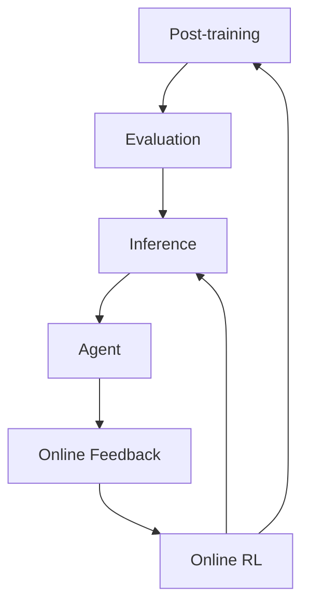

# Online Feedback
Online RL / Train-Inference Integrated Post-training
> 中文直觉解释：Online Feedback 不是简单收集用户点赞点踩，而是让线上任务、rollout、verifier、RL 训练和新策略部署形成持续闭环。

## Table of Contents

- [TL;DR](#tldr)
- [Definition](#definition)
- [Why It Matters](#why-it-matters)
- [Where It Fits in the LLM Pipeline](#where-it-fits-in-the-llm-pipeline)
- [Historical Background](#historical-background)
- [Technical Pipeline](#technical-pipeline)
- [Core System Components](#core-system-components)
- [Online RL as Train-Inference Integration](#online-rl-as-train-inference-integration)
- [Why Agent Systems Need Online RL](#why-agent-systems-need-online-rl)
- [Relationship with Test-Time Compute](#relationship-with-test-time-compute)
- [Common Infrastructure Challenges](#common-infrastructure-challenges)
- [Common Misunderstandings](#common-misunderstandings)
- [Recruiting Lens](#recruiting-lens)
- [Candidate Signals](#candidate-signals)
- [Pre-talk Questions](#pre-talk-questions)
- [Simple Analogy](#simple-analogy)
- [Sources](#sources)
- [Open Questions](#open-questions)

## TL;DR

Online Feedback 是 LLM 工业链路的最后一环：模型上线后，真实任务、失败案例、用户行为、agent trajectory、verifier 结果和 A/B test 会反过来推动下一轮 post-training。

其中最值得重点理解的是 Online RL。它不是普通的 online data collection，也不是把线上日志攒起来做一次 finetuning。Online RL 指的是 tightly coupled train-inference infrastructure：inference / rollout engines 高吞吐地产生 trajectories，reward / verifier 系统评估这些 trajectories，RL framework 计算 policy update，distributed training backend 更新模型，然后新 policy 很快参与下一轮 rollout。

这个方向有意思，是因为 LLM 的 inference 不再只是“服务用户请求”。在 reasoning、coding、tool use 和 agent 场景里，inference 侧产生的大量 token、工具调用、执行结果和环境反馈，本身就是训练燃料。换句话说，现代 post-training 正在从离线数据工程，走向 rollout-driven policy optimization。

## Definition

Online Feedback 是 deployed model 之后的持续改进闭环。

```python
OnlineFeedback = collect_and_use(
    signals = {
        user_feedback,
        failure_cases,
        conversation_logs,
        agent_trajectories,
        tool_results,
        verifier_scores,
        environment_rewards,
        ab_test_metrics,
    },
    goals = {
        find_failures,
        improve_post_training_data,
        update_eval_sets,
        optimize_policy,
        monitor_regressions,
    }
)
```

Online RL 是 Online Feedback 中最强耦合、最工程化的一类：

```python
OnlineRL = train_inference_loop(
    rollout = inference_engine.generate_trajectories(policy),
    reward = verifier_or_environment.score(rollout),
    update = rl_framework.optimize(policy, reward),
    sync = distributed_training.publish_new_policy(update),
    next_round = inference_engine.generate_trajectories(new_policy),
)
```

这里的 online 重点不是“用户实时反馈”，而是 rollout 和 policy update 在同一个生产级系统里连续发生。它更接近 post-training train-inference integration，而不是传统意义上的日志采集。

## Why It Matters

Pretraining scaling 仍然重要，但成本越来越高。很多 frontier capability 不再只靠更多网页文本和更大模型自然涌现，而是来自 post-training 阶段对 reasoning、coding、tool use、agent task completion 和 test-time compute 的持续优化。

Online RL 变重要有三个原因：

- 静态 SFT 数据不够。模型需要探索不同解法，尤其是数学、代码、浏览器任务和长链路 agent task。
- 很多任务开始可验证。代码可以跑单测，数学可以用 verifier，工具调用可以看执行结果，浏览器和 computer-use 任务可以看环境状态。
- on-policy data 更值钱。agent 当前 policy 会犯什么错、会在哪一步卡住，只有让它自己 rollout 才看得见。

如果把 post-training 看成“给模型补课”，Online RL 更像“让模型在真实或仿真任务场里练习，并且每一轮练习都立刻改变下一轮练习方式”。

## Where It Fits in the LLM Pipeline



Online Feedback 位于 deployment 之后，但它影响的不是单一模块。它会回流到：

- Data：失败样本、hard negatives、tool traces、trajectory 数据。
- Post-training：SFT refresh、RL、distillation、safety tuning。
- Evaluation：把线上失败变成 regression eval。
- Inference：优化 serving policy、routing、cache、latency 和成本。
- Agent：改进 tool use、planning、memory、retry 和 sandbox execution。

Online RL 则是其中最贴近 post-training infra 的部分：它要求 inference system 和 training system 不再是两个松散连接的部门，而是同一个闭环里的两个半边。

## Historical Background

早期 RLHF 更像离线 pipeline：收集 prompt，生成多个回答，人类或 reward model 排序，再训练 policy。这个阶段的核心问题是 alignment 和偏好建模。

后来 reasoning model 和 coding agent 把问题推向了另一个方向。OpenAI o1 把 reasoning 和 test-time compute 推到前台；DeepSeek-R1 展示了 verifier-driven RL 对 reasoning behavior 的影响；Cursor Tab 的公开分享把 Online RL 放进真实 coding suggestion 产品里讨论；Cursor Composer 的 real-time RL 进一步明确提出：真实 inference 产生的海量 tokens 可以被提炼成训练信号。

这背后的变化是：LLM 不只是回答问题，而是在执行任务。执行任务会产生 trajectory：模型想了什么、调用了什么工具、跑了什么命令、测试有没有过、浏览器状态有没有改变、用户最后有没有接受。这些 trajectory 比单条 prompt-response 更接近模型真正需要优化的对象。

## Technical Pipeline

Online RL 的工业 pipeline 可以极简理解为六步：

1. Rollout generation：用当前 policy 生成大量回答、推理链、代码 diff、tool call 或 agent trajectory。
2. Environment execution：在 sandbox、unit test、browser、terminal、API tool 或 simulator 中执行模型动作。
3. Reward / verifier scoring：把执行结果转成 reward、pass/fail、partial credit 或 preference signal。
4. RL optimization：用 PPO、GRPO、DAPO、RLOO 等方法计算 policy update。
5. Policy synchronization：把新 policy、reference model、reward model、checkpoint 和 serving endpoint 同步。
6. Evaluation and gating：通过 offline eval、shadow traffic、canary、A/B test 和 safety checks 决定是否放量。

核心不是某个算法名字，而是这条链路能不能稳定、高吞吐、低延迟、可回滚地跑起来。

## Core System Components

### Rollout / Inference Engines

代表系统包括 vLLM 和 SGLang。它们原本常被理解成高吞吐 serving stack，负责 continuous batching、KV cache、prefix cache、long-context serving、structured output 和 tool-call serving。

在 Online RL 中，inference engine 变成 rollout factory。它不只是服务线上请求，还要为 RL 训练持续生成 trajectories。一个好的 rollout engine 要能处理：

- 大量并发采样；
- 长上下文和多轮 agent trajectory；
- 多 temperature / 多 sample 策略；
- prefix cache 和 KV cache 复用；
- 与 sandbox、verifier、tool server 的低摩擦连接；
- rollout 数据和训练数据格式的稳定落盘。

### RL Frameworks

代表系统包括 verl / VeRL，以及围绕 PPO、GRPO、DAPO、RLOO 等方法的训练实现。

RL framework 负责把 rollout 变成 policy update。它通常需要协调 actor model、reference model、reward model 或 verifier、advantage computation、KL control、trajectory replay / filtering 和 checkpoint 管理。

对招聘判断来说，候选人不一定要会从零推导 PPO 公式，但要理解为什么 RL 训练比 SFT 更难工程化：数据由当前 policy 生成，reward 可能昂贵或有噪声，policy 更新后 rollout 分布马上变化，训练系统和推理系统必须同步。

### Reward & Verifier Systems

Online RL 最近变得实际，是因为越来越多 LLM 任务可以被验证。

常见 verifier / reward 来源：

- math：答案校验、symbolic verifier、过程或最终结果评分；
- coding：unit tests、lint、build、execution correctness、SWE task completion；
- tool use：API 调用是否成功，参数是否正确，结果是否被正确使用；
- browser / computer use：页面状态、目标完成度、操作轨迹；
- agent environment：任务完成、步数、成本、失败恢复、是否触发安全边界。

Verifier 的质量往往决定 Online RL 的上限。错误 reward 会把模型推向投机行为，例如 hard-code test、骗过 judge、过度调用工具或生成看似合理但不可执行的计划。

### Distributed Training Backends

Online RL 仍然需要大规模训练基础设施。常见组件包括 FSDP、Megatron、Ray，以及 CUDA / NCCL 通信栈。

它们在 Online RL 里的重点不只是吞吐，还包括 actor-learner coordination、async rollout consumption、checkpointing、policy synchronization 和 fault tolerance。训练端要消费 rollout，推理端要拿到新 policy，eval 端要判断是否可发布，中间任何一个环节慢下来都会影响闭环速度。

### Agent Environments

Agent environment 是 Online RL 的任务场。它可以是代码仓库、terminal、browser、MCP tools、API sandbox、document editing environment、robotics simulator 或 CUA 环境。

Agent RL 的困难在于 reward 延迟更长，动作空间更复杂，失败原因更分散。模型可能第一步 plan 就错了，也可能 tool call 参数错了，或者最后一步没有保存文件。Online RL infra 必须保留完整 trajectory，否则很难判断该奖励哪一步、惩罚哪一步。

## Online RL as Train-Inference Integration

Train-Inference Integration 是更大的基础设施趋势。Online RL 是 post-training 中最典型、最强耦合的场景。

```text
Train-Inference Integration
└── Online RL
    ├── Reasoning RL
    ├── Coding RL
    ├── Tool-use RL
    ├── Agentic RL
    └── Browser / CUA / Robotics RL
```

传统边界里，training team 产出模型，inference team 负责部署。Online RL 把这个边界打穿：inference 侧生成的吞吐 token、tool traces、accept / reject signals 和 environment results，会直接成为 RL training 的输入；training 侧产生的新 checkpoint，又会快速进入 rollout engine 继续采样。

所以 vLLM / SGLang 这类系统不再只是“把模型跑得快”。在 Online RL 里，它们决定 rollout 成本、样本新鲜度、训练节奏和 agent task 覆盖面。

## Why Agent Systems Need Online RL

Agent 系统的问题不是“回答是否像人”，而是“任务是否完成”。这类能力很难只靠静态标注数据覆盖。

Coding agent 要改 repo、跑测试、理解失败日志；browser agent 要搜索、点击、回读页面状态；computer-use agent 要处理 GUI 状态变化；robotics agent 要面对环境反馈。这些任务天然要求 interaction 和 exploration。

Online RL 让 agent 可以围绕真实完成度优化：

- 不是只学一个标准答案，而是学会多步尝试；
- 不是只优化文本偏好，而是优化 executable outcome；
- 不是只看单轮 chat，而是看完整 task trajectory；
- 不是只学习成功案例，也能系统性挖掘失败模式。

## Relationship with Test-Time Compute

Test-time compute 指模型在推理时投入更多计算，例如更长思考、多样本采样、self-consistency、tree search、tool use 或 agent loop。

Online RL 和 test-time compute 是互相强化的关系：

- Test-time compute 产生更多 trajectories，给 RL 更多探索数据。
- RL 学会哪些推理路径、工具路径和搜索策略更值得花 compute。
- Verifier 把“多想一会儿是否真的更好”变成可优化信号。

这也是 o1、DeepSeek-R1、coding agent 和 browser agent 讨论经常连在一起的原因：模型能力不只来自参数，也来自训练时和推理时如何组织搜索、验证和反馈。

## Common Infrastructure Challenges

- Rollout cost：采样量越大，GPU inference 成本越高；长上下文和 agent loop 会进一步放大成本。
- Trajectory freshness：policy 更新后，旧 trajectory 可能变得 off-policy，继续训练会降低效果或引入偏差。
- Reward reliability：verifier 错误、测试覆盖不足或 reward hacking 会污染训练信号。
- Async coordination：rollout、training、eval、checkpoint、serving endpoint 必须协调，不能互相堵塞。
- Sandbox security：coding、browser、tool-use RL 需要隔离执行环境，防止数据泄露和危险操作。
- Long-context memory：agent trajectory 很长，KV cache、日志存储、截断策略和 replay 格式都会变成成本问题。
- Regression gating：新 policy 可能在某类任务变强，同时损伤安全、格式遵循、延迟或普通 chat 体验。
- Observability：需要能追踪每个 reward 来自哪个环境、哪版 policy、哪个 verifier 和哪段 trajectory。

## Common Misunderstandings

- Online RL 不等于 online finetuning。Finetuning 可以是离线批处理；Online RL 强调 rollout-policy update 闭环。
- Online RL 不等于 user feedback logging。用户反馈只是信号之一，agent trajectory 和 verifier result 往往更关键。
- Online RL 不等于简单 RLHF。RLHF 常围绕偏好；Online RL 更关注可验证任务、环境交互和策略优化。
- vLLM / SGLang 不只是 serving stack。在 Online RL 中，它们是 rollout infrastructure。
- Online RL 不是纯算法问题。很多瓶颈在系统耦合、调度、sandbox、reward、eval 和发布流程。
- 最难的部分常常不是“选 PPO 还是 GRPO”，而是让 rollout、reward、training、checkpoint 和 serving 形成稳定闭环。

## Recruiting Lens

Pretraining infra engineer 和 Online RL infra engineer 都需要强分布式系统能力，但关注点不同。

Pretraining infra 更关注：

- GPU cluster utilization；
- tensor / pipeline / data parallelism；
- communication efficiency；
- checkpointing and fault tolerance；
- long-running training stability。

Online RL infra 更关注：

- rollout throughput；
- verifier and sandbox integration；
- trajectory storage and filtering；
- async policy update；
- actor-learner coordination；
- policy freshness and rollback；
- agent execution reliability。

团队 ownership 上，Online RL 常横跨 post-training、inference、eval、agent infra 和 product telemetry。强候选人要能在这些边界之间说清楚 trade-off，而不是只停留在某个算法名。

## Candidate Signals

Strong signals：

- 做过 LLM RL、RLHF、RLVR、agent training、coding agent eval 或 verifier-based training。
- 理解 vLLM / SGLang / Ray / FSDP / Megatron 中至少一部分系统，并能讲清它们在 rollout-training loop 里的位置。
- 能解释 on-policy / off-policy、policy lag、KL control、reward hacking、sandbox isolation 这些工程问题。
- 有高吞吐 inference、distributed training、GPU scheduling、NCCL debugging 或 large-scale evaluation 经验。
- 做过代码执行、浏览器任务、tool-use agent、unit-test verifier 或环境奖励系统。

Weak signals：

- 只说“我们收集用户反馈再训练”，但讲不清 trajectory、reward、policy update 和 eval gating。
- 只熟悉离线 SFT 数据处理，不理解 rollout engine 为什么会成为训练系统的一部分。
- 只会背 PPO / GRPO 名词，讲不出系统瓶颈在哪里。

Risk signals：

- 把线上用户流量直接当训练数据，忽略隐私、安全、过滤、consent 和数据污染。
- 过度相信自动 verifier，忽略 reward hacking 和 regression eval。
- 只优化 benchmark reward，不关心实际产品延迟、成本和稳定性。

## Pre-talk Questions

- 你怎么向非 RL 背景的人解释 Online RL 和 online finetuning 的区别？
- 如果让你设计一个 coding agent 的 Online RL 系统，你会怎么组织 rollout、unit test verifier、RL training 和 policy 发布？
- vLLM / SGLang 在 Online RL 里为什么不只是 serving engine？
- policy 更新后，旧 trajectory 还能不能继续用？你会怎么处理 freshness 和 throughput 的 trade-off？
- 如果 verifier 会被模型 hack，你会怎么发现和缓解？
- Online RL infra 和 pretraining infra 最大的工程差异是什么？
- 对一个 Cursor Tab / Composer 类产品，什么样的线上信号可以成为 reward，什么信号只能作为 telemetry？

## Simple Analogy

普通 online feedback 像教练看比赛录像：收集失误，整理问题，再安排下一次训练。

Online RL 更像训练场和比赛场连在一起：模型一边高频上场试动作，一边由裁判和计分系统打分，训练系统马上根据结果调整策略，新策略再回到下一轮练习。

## Sources

- [OpenAI: Learning to Reason with LLMs](https://openai.com/index/learning-to-reason-with-llms/)
- [OpenAI: o1 System Card](https://openai.com/index/openai-o1-system-card/)
- [DeepSeek-R1 paper: Incentivizing Reasoning Capability in LLMs via Reinforcement Learning](https://arxiv.org/abs/2501.12948)
- [DeepSeek-R1 model card on Hugging Face](https://huggingface.co/deepseek-ai/DeepSeek-R1)
- [Cursor Blog: Improving Cursor Tab with online RL](https://cursor.com/blog/tab-rl)
- [Cursor Blog: Improving Composer through real-time RL](https://cursor.com/blog/real-time-rl-for-composer)
- [verl GitHub repository](https://github.com/volcengine/verl)
- [vLLM documentation](https://docs.vllm.ai/)
- [SGLang documentation](https://docs.sglang.ai/)
- [Ray documentation](https://docs.ray.io/)
- [PyTorch FSDP documentation](https://pytorch.org/docs/stable/fsdp.html)
- [NVIDIA Megatron-LM GitHub repository](https://github.com/NVIDIA/Megatron-LM)

## Open Questions

- Online RL 的最佳 rollout-training 比例是什么？不同任务是否需要不同节奏？
- Agent trajectory 很长时，应该奖励最终结果、关键中间步骤，还是两者结合？
- Hosted model 的 serving stack 会不会成为 Online RL 效果的重要隐性优势？
- 如何区分真正的 reasoning improvement 和对 verifier / benchmark 的适配？
- 生产环境中，哪些 user feedback 可以安全进入训练，哪些只能进入 eval 或 monitoring？
- Online RL 会不会让 inference infra 和 training infra 团队合并成新的 post-training platform team？
