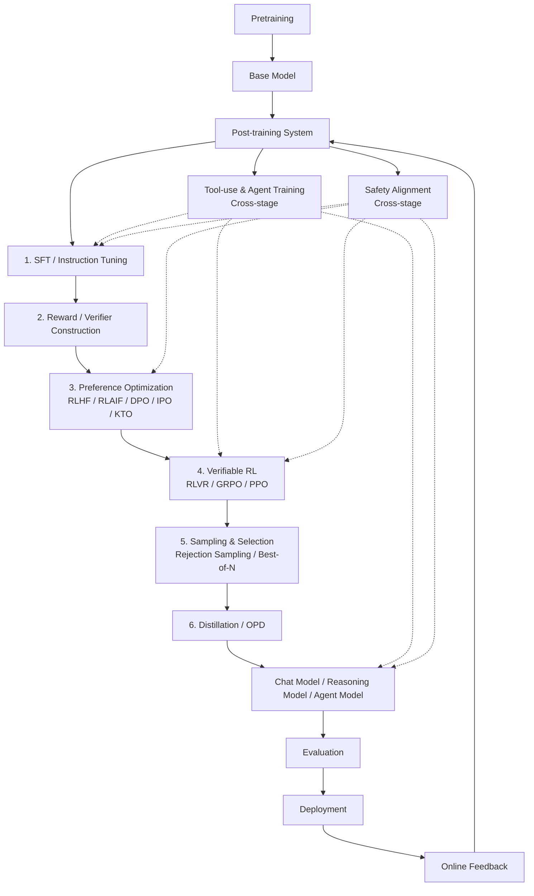

# Post-training
From Instruction Alignment to Agentic Capability Construction
> 从“让模型会回答”到“让模型会推理、会调用工具、会解决问题”

## Table of Contents

- [TL;DR](#tldr)
- [Definition](#definition)
- [Pipeline Position](#pipeline-position)
- [What Changes After Post-training](#what-changes-after-post-training)
- [Core Methods](#core-methods)
- [System View & Data Loop](#system-view--data-loop)


## TL;DR

Post-training 是把 base model 训练成可用模型的关键阶段，模型从“会预测下一个 token”塑造成“会遵循指令、会推理、会调用工具、会解决问题”。
它不只是传统意义上的 instruction alignment / RLHF，而是一个复杂的系统性工程：
SFT 提供行为示范，Reward / Verifier 定义优化目标，RL 优化推理与行动策略，Agentic Environment Training 让模型在代码、搜索、工具和 sandbox 环境中学习完成任务，Distillation / Capability Integration 负责合并多种专项能力，Evaluation Loop 则持续验证模型是否真的更可靠、更可控、更适合部署。

## Definition
Post-training 是对 pretrained base model 执行的 behavior optimization and capability consolidation stage。下面用Python更逻辑清晰的表示一下：

```python
BaseModel = pretrained_model(
    objective = next_token_prediction,
    learned = {
        language,
        knowledge,
        code,
        reasoning_patterns,
        tool_use_patterns,
    }
)

PostTraining(BaseModel) = optimize_behavior(
    model = BaseModel,
    signals = {
        demonstrations,      # SFT
        preferences,         # RLHF / DPO
        rewards,             # RL / GRPO / PPO
        verifiers,           # RLVR / executable feedback
        trajectories,         # agentic data
        safety_constraints,
    },
    environments = {
        chat,
        code,
        search,
        tools,
        sandbox,
        MCP,
    },
    objective = {
        instruction_following,
        reasoning,
        tool_use,
        coding_agent,
        search_agent,
        long_horizon_task_execution,
        safety,
        deployability,
    }
)
      
```

## Pipeline Position

Post-training 位于 pretraining 之后、deployment 之前，是 base model 到产品模型之间的关键桥梁。

## What Changes After Post-training
## What Changes After Post-training
## Core Method
## System View & Data Loop
